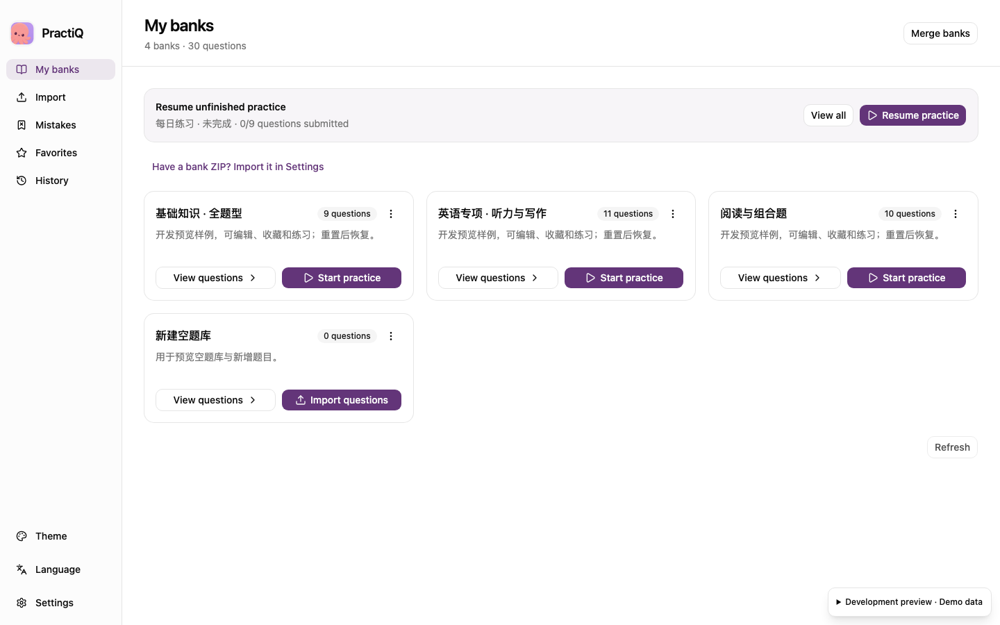
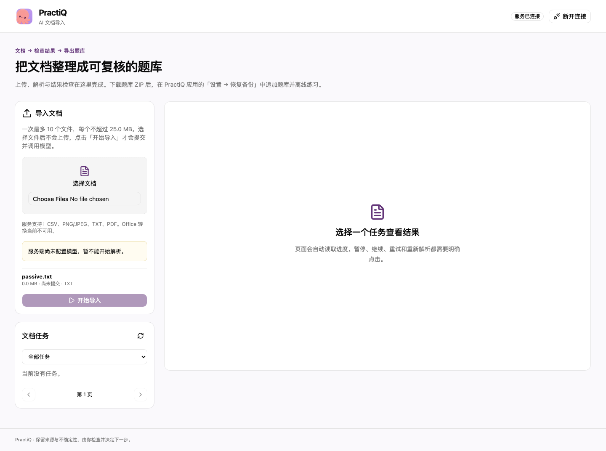

<p align="center">
  
</p>

# PractiQ

English | [简体中文](README.zh-CN.md)

Turn documents into question banks, then practise and take mock exams offline on macOS, Windows or Android.

- **Import and review**: extract questions from documents with AI, review warnings, and organize your banks.
- **Practise and test**: select across banks by question type, mistakes, bookmarks, or unanswered questions; practise, take self-tests, or set up timed exams.
- **Review scores**: score objective questions locally, request AI short-answer grading, or record manual corrections.
- **Keep and share**: resume sessions, back up personal records, and share banks with images and audio as ZIP files.

The app supports Simplified Chinese and English, light and dark themes, seven basic question types, and English listening, reading, cloze, translation, and writing tasks. Practice data stays on your device; there are no accounts or cloud sync.

PractiQ is in development. There is no published GitHub Release yet; run it from source using the instructions below. Platform build checks do not establish signed-release or clean-machine acceptance.



Development preview using in-memory sample data.

## Try it without a model

[Run the desktop app](#run-the-desktop-app), then:

1. Choose **Add example bank** when **My banks** is empty, or import [sample.zip](app/fixtures/sample.zip) through **Settings → Restore backup → Import bank ZIP**. Import shortcuts in the bank header, empty states and question lists open this same restore menu, where bank import and full-data replacement remain distinct. Only choosing **Import bank ZIP** opens the native ZIP picker; select the destination bank in the preview and confirm to append content.
2. Open the bank and choose **Start practice**. Try practice, an untimed self-test, or a timed mock exam.
3. Submit your answers and review scores and explanations.

No API key is needed. The hand-written samples demonstrate question types and review flags; they are not model evaluations. More examples: [composite questions](app/fixtures/composite.zip) and [all question types](app/fixtures/all-types.zip).

See the [practice guide](docs/practice-guide.md) for answer submission, self-assessment, draft protection, language settings and optional AI grading.

Export a bank from its card menu to share content without personal answers or scores. Bank import appends content; restoring a full learning-data backup replaces personal data after confirmation. See the [package guide](docs/question-bank-package.md).

## Import documents with AI

Use the independent service's Web frontend for document import:

1. Start the [independent AI service](#run-the-ai-service-independently), open its Web frontend and enter the service access token. Model configuration and provider credentials stay in the service environment.
2. Select up to 10 source files and explicitly choose **Start import**. Selecting files does not upload or parse them.
3. Inspect task progress, saved questions, images, supplied answers and review warnings. Download the result as a question-bank ZIP.
4. In the desktop app, use **Settings → Restore backup → Import bank ZIP** to create a bank or append content to an existing bank.

The service accepts **PDF, TXT, CSV and PNG/JPEG**. Deployments configured with LibreOffice also accept **DOC, DOCX, XLS and XLSX**. Office normalization runs in the service, using PDF by default or text exports, including hidden Excel sheets. Desktop packages contain no Python service or LibreOffice. See the [Office guide](server/docs/desktop-office.md) for deployment and fidelity boundaries.

Task history, pause, interrupt, resume, failed-unit retry, partial-result review and parse-again controls belong to the Web frontend. Read-only review and ZIP download make no model calls. Resume, retry and parse again are explicit actions; their model work may incur charges. See the [import task guide](docs/import-tasks.md).



Browser capture of the built Web frontend served by a local read-only AI service, with an empty task database and no configured model. Selecting the sample file made no upload or model call.

Parsing extracts supplied answers and rubrics without solving unanswered questions. Missing content stays flagged for review. Download results within **180 days** to keep them; task expiry does not affect banks already imported into the app.

Offline practice needs no service. For optional subjective AI grading, configure **Settings → AI service**, then explicitly start grading or retry. A reference answer or rubric is required; failed, unknown or unsupported results remain ungraded. See the [practice guide](docs/practice-guide.md#use-optional-ai-grading).

Development starts with in-memory sample data. The preview panel lets you switch scenarios or choose real local data. See [development preview](app/docs/development-preview.md) for its controls and boundaries.

## Run the desktop app

Desktop data uses a fresh `v4/` directory and SQLite schema 11. Earlier directories, including `v3/`, remain untouched; old full backups are rejected. Current question-bank ZIP files can still be imported. See the [data format boundaries](docs/question-model.md#versions-and-directories).

App targets are macOS 14+ (Apple Silicon), Windows 10/11 (x64), and Android 8+ (API 26+, arm64 APK). Linux app packages are removed. Linux remains an AI-service and CI host. CI checks native macOS/Windows packages and an Android APK plus API 35 emulator tests; physical-device, minimum-version and signed-release acceptance remain separate.

Development requires Node.js 22.12+ and Rust. Package preparation and shared-contract checks also use an existing Python 3.14+ interpreter and uv; Python is a build tool and is not shipped in the desktop package. Install the [Tauri platform prerequisites](https://v2.tauri.app/start/prerequisites/): Xcode on macOS or MSVC build tools and WebView2 on Windows. Android also needs JDK 21, SDK 36 and NDK 28.2.13676358; see the [Android guide](app/docs/android.md). Do not create a project `.venv`.

Clone the repository and enter its root directory:

```sh
git clone https://github.com/shenyankm/PractiQ.git
cd PractiQ
```

On macOS, replace the Python path with your interpreter:

```sh
make install-locked AI_PYTHON=/path/to/python3.14
make app-install
cargo fetch --locked --manifest-path app/src-tauri/Cargo.toml
make app-dev AI_PYTHON=/path/to/python3.14
# Build a local application package:
make app-build AI_PYTHON=/path/to/python3.14
```

On Windows, use PowerShell from the repository root:

```powershell
npm --prefix app ci
cargo fetch --locked --manifest-path app/src-tauri/Cargo.toml
python app/scripts/prepare-package.py
cd app
npm run desktop
# Build the Windows installer:
npm run tauri -- build
```

Use Python 3.14+ for `prepare-package.py`. It generates build metadata and Cargo/npm notices, without downloading or copying document-processing runtimes. Packages are written under `app/src-tauri/target/release/bundle`: `.app`/`.dmg` on macOS and NSIS `.exe` on Windows. Android APKs use the separate [Android build and emulator commands](app/docs/android.md). Package checks verify version, notices and absence of embedded engines; they do not certify signing or interactive playback.

## Run the AI service independently

The independent service provides document import through its Web frontend and API, and explicit grading for the desktop. Use Python 3.14+, uv, Node.js 22.12+ for the Web build, and a model supporting text and image inputs. Copy the configuration template without overwriting existing settings:

```sh
cp -n .env.example .env
```

Set the service token, model credentials, `LLM_MODEL`, the PostgreSQL URL `DATABASE_URI`, and file storage in `.env`. Provision an empty dedicated PostgreSQL database, then initialize its service tables and start:

```sh
make install-locked AI_PYTHON=/path/to/python3.14
make init-db AI_PYTHON=/path/to/python3.14
make web-install
make web-build
make server-dev AI_PYTHON=/path/to/python3.14
```

The FastAPI/LangGraph service listens on `127.0.0.1:8090`, uses PostgreSQL and local file storage, and runs one process per database. Uploads, tasks, artifacts, and grading require authentication. Open `http://127.0.0.1:8090/` for the built Web frontend. For development, run `make web-dev` separately; its loopback Vite server proxies API requests to the service. Configure `AI_OFFICE_EXECUTABLE` and `AI_OFFICE_VERSION` only on the service when Office support is needed. See the [service guide](server/docs/service-guide.md).

## Documentation and development

Start with the [documentation index](docs/README.md) for user guides, technical references, acceptance worksheets and historical evidence.

- [Document task API](server/docs/document-tasks.md): progress, pause, resume, retry, and review
- [Operations](server/docs/operations.md): deployment, storage, and recovery
- [Evaluation](server/docs/evaluation.md): datasets, checks, and evidence limits
- [Web asset measurements](docs/performance-web-fonts-20261009.md): full static size, build samples and font validation
- [Question model](docs/question-model.md): question types and composite question rules
- [Release verification](CONTRIBUTING.md#release-verification): publication checks and acceptance evidence
- [Release policy](docs/releases.md): version tags, downloads, checksums and the manual draft workflow
- [Contributing](CONTRIBUTING.md): development checks and pull requests

Run `make app-check` on macOS/Windows for app checks and follow the [Android guide](app/docs/android.md) for shared checks on any Android development host, APK builds and native emulator checks, `make web-check` for the import Web frontend and `make verify` for the AI service. Playwright Test checks bilingual interactions, browser preview, and rich-content rendering with mocked native commands and no model calls:

```sh
cd app
npx playwright install chromium --only-shell
npm run test:browser
```

The runner starts its own loopback Vite servers. Use `npm run test:preview` or `npm run test:rich-content` for an individual check. Failed tests retain traces and screenshots under `app/test-results/browser/`; inspect a trace with `npx playwright show-trace /path/to/trace.zip`.

## Get help and contribute

Report reproducible bugs or propose improvements through [GitHub Issues](https://github.com/shenyankm/PractiQ/issues/new/choose). Follow [the contribution guide](CONTRIBUTING.md) for changes and [the security policy](SECURITY.md) for private vulnerability reports.

Project source uses the [MIT license](LICENSE). Bundled dependencies retain their [upstream notices](app/licenses/README.md).

The [roadmap evidence record](docs/roadmap-evidence.md) links the current quality, release, user-trial and contributor workstreams with their remaining acceptance requirements. The native GitHub roadmap and sub-issues remain authoritative.
