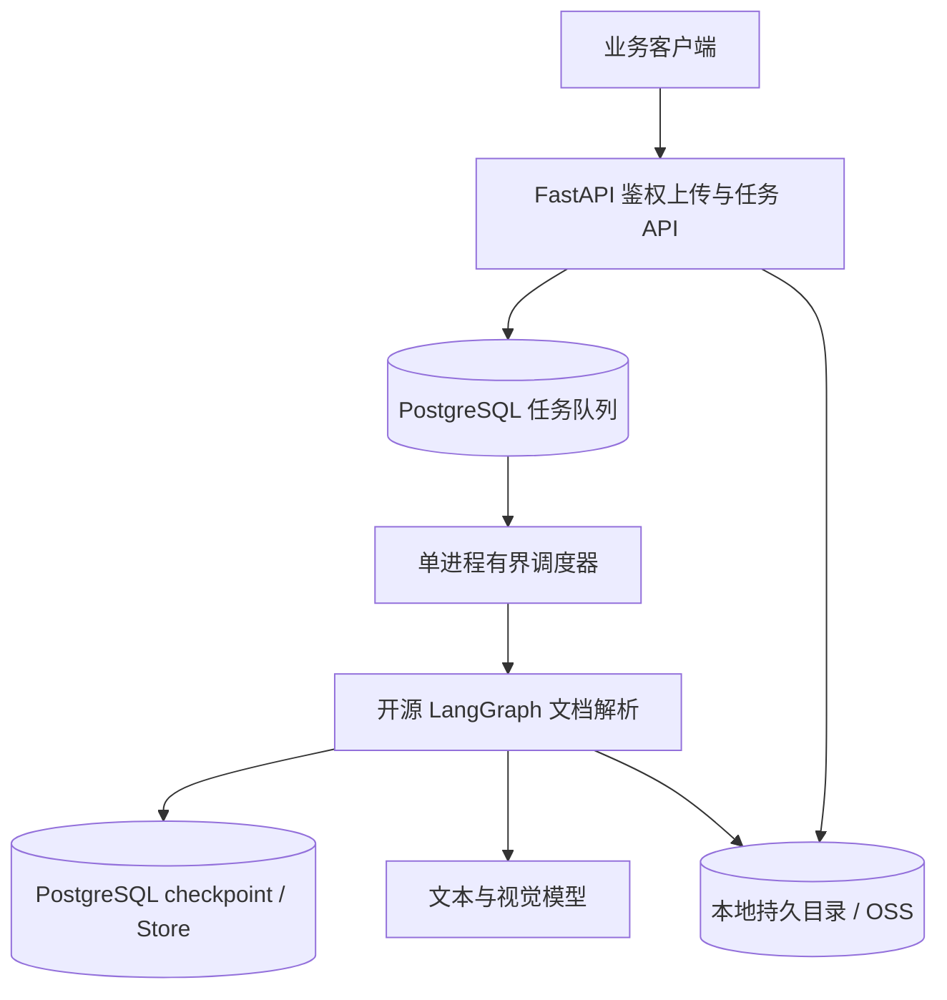

<p align="center">
  
</p>

# PractiQ

[English](README.md) | 简体中文

AI 文档导入工具：将文本、CSV、PDF、图片、Word 和 Excel 解析为结构化题目、材料题组、原文答案及视觉素材。支持安全暂停、立即中断、恢复、失败单元补跑、可选人工决策及模型调用用量记录。

代码保留在 `server/`，通过 FastAPI + 开源 LangGraph + PostgreSQL 提供服务，无需商业 Agent Server 运行授权；不包含前端、题库管理、练习判分、答案生成或学习报告。

## 本地运行

使用已有 Python 3.14+ 解释器，不创建项目 `.venv`。`AI_PYTHON` 可指定解释器路径。

```bash
# 仅首次复制；已有模型配置不要覆盖
cp -n .env.example .env
# 配置服务令牌、模型、新建的 PostgreSQL 数据库及独立文件存储
make install AI_PYTHON=/path/to/python3.14
make init-db AI_PYTHON=/path/to/python3.14
make server-dev AI_PYTHON=/path/to/python3.14
```

默认监听 `127.0.0.1:8090`，活性检查为 `GET /ok`，就绪检查为 `GET /ready`。本地和生产均需要 PostgreSQL；初始化仅接受空数据库，不读取或迁移旧 Agent Server 数据。单服务进程持有独占锁，重启自动恢复未完成任务，人工暂停和审核保持等待。

`LLM_TEXT_MODEL` 与 `LLM_VISION_MODEL` 均必填，共用 provider 和 API key。TXT/CSV 使用文本模型；PDF/DOCX/图片直接视觉提题；XLSX 按工作表联合输入单元格、带锚点的图片及图表/形状渲染页，使用视觉模型。DOCX 依赖 LibreOffice Writer，Excel 图表/形状依赖 Calc；部署镜像包含中文字体。通过 `AI_SOFFICE_PATH` 指定转换程序。

## 导入流程

1. 携带 `Authorization: Bearer <AI_SERVICE_TOKEN>`，调用 `POST /api/uploads` 申请文件引用。
2. 使用返回的地址和 Content-Type 鉴权 PUT 原始文件；已有文件可能直接返回引用。
3. 将 `document` 与 UUID `requestId` 交给 `POST /api/document-tasks`，通过 `GET /api/document-tasks/{threadId}` 查询；不再暴露官方原生 Graph/SDK API。
4. 使用 `POST /api/artifacts/read` 提交 `ArtifactReference`，鉴权并校验大小与 SHA-256 后读取原始素材字节。

支持 `text_csv_parser`、`pdf_parser`、`docx_parser`、`excel_parser`，以及覆盖全部格式的 `document_parser`。任务入口不接受 URL、Base64 或服务器路径；原产品 `/api/v1/ai/*` 接口已移除。

暂停、中断、恢复、补跑、接受部分结果统一调用 `POST /api/document-tasks/{threadId}/control`。请求示例、幂等规则、180 天期限见 [任务控制说明](server/docs/document-tasks.md)。

## 验证与数据

```bash
make test AI_PYTHON=/path/to/python3.14
make verify AI_PYTHON=/path/to/python3.14
```

自动化测试不调用真实模型；[评测说明](server/docs/evaluation.md) 和历史报告保留，历史失败结果不代表当前质量基线。

支持 `AI_STORAGE_BACKEND=local`（默认）和 `oss` 两种模式，共用鉴权上传和素材读取接口，保留大小与 SHA-256 校验。

本地模式下，AI 文件默认存放于 `server/.local/ai-oss`，相对 `AI_STORAGE_DIR` 以 `server/` 为基准解析；生产使用持久挂载的绝对路径并备份。精简项目不会迁移或删除已有数据库、卷、文件和本地配置。生产部署参考 [运维说明](server/docs/operations.md) 与 `Dockerfile.server`。

OSS 模式需在 `.env` 配置 `AI_OSS_REGION`、`AI_OSS_BUCKET`、`AI_OSS_ACCESS_KEY_ID` 和 `AI_OSS_ACCESS_KEY_SECRET`；临时 STS 凭证可加 `AI_OSS_SECURITY_TOKEN`。可通过 `AI_OSS_ENDPOINT` 指定 HTTPS 端点；使用已绑定到 Bucket 的自定义域名时，设置 `AI_OSS_USE_CNAME=true`。完整配置见 `.env.example`。

使用已有私有 Bucket，仅授予所需对象的访问权限。凭证保留在服务端，文件仍通过鉴权 API 传输。切换模式不自动迁移数据，也不回退到另一种存储；迁移须按原 objectKey 复制并验证全部对象。新版任务拒绝存储位置变化，须在原部署完成或迁移后新建任务；历史 checkpoint 不升级。临时凭证需在过期前更新并重启服务。

源文件使用 `practiq-agent/sources/`，衍生文本与图片使用 `practiq-agent/artifacts/`；OSS 对象键与本地相对路径一致。仅授予这些前缀所需的 GetObject（含 HEAD）与 PutObject 权限，不需要创建 Bucket、列举或删除权限。OSS 使用[官方 Python SDK V2](https://www.alibabacloud.com/help/en/oss/developer-reference/2-0-manual-preview-version/)；连接和读写超时沿用 `AI_STORAGE_TIMEOUT_SECONDS`，异常返回统一存储错误。

## Graph 与接口示例

仓库注册四个格式专用 Graph，以及一个兼容入口：

| Graph ID | `document.sourceType` |
| --- | --- |
| `text_csv_parser` | `text`、`csv` |
| `pdf_parser` | `pdf` |
| `docx_parser` | `docx` |
| `excel_parser` | `xlsx`（不支持旧版 `.xls`） |
| `document_parser` | 原有全部格式，包括 `image`；兼容已有调用 |

各入口共用提取、视觉处理、分片与合并逻辑。专用入口在读取本地文件 前校验格式，
不匹配时抛出 `DOCUMENT_SOURCE_TYPE_MISMATCH`；从 checkpoint 恢复到读取节点时也会校验。
这些 Graph 仍共享当前部署的 worker 与并发设置，不提供独立资源隔离。

例如上传 PDF 后，向 `POST /api/document-tasks` 提交 `requestId`、`graphId="pdf_parser"` 和上传返回的 `document` 引用。接口返回 202 回执，通过任务 GET 轮询结果和进度；不再提供 `/threads`、`/runs`、`/store` 或原生 SSE 接口。

Graph 结果仍为 `{ "status": "SUCCEEDED", "result": {...}, "processing": {...}, "usage": [...] }`，也可能返回 `PARTIAL` 或执行失败。完整控制示例见 [任务 API](server/docs/document-tasks.md)。

## 系统架构



## 核心边界

- 源文件经服务令牌鉴权的 PUT 接口写入选定存储。解析前均校验大小和 SHA-256。
- DOCX 通过普通提取函数校验文件（Pydantic 严格限制为字节输入），以 LibreOffice 转临时 PDF，再逐页渲染；同时直接提取内嵌原图。
- PDF（含文字版）与 DOCX 的全部页面均以约 200 DPI 转图，必须配置视觉模型。页面图像直接输出结构化题目、分组和图形，不生成 OCR 文本、不再交给文本模型提题。每页携带相邻页作为上下文，只输出起始于本页的题目；超出窗口的续文保留缺失字段，不猜测。失败页单独补跑并重新合并，成功页不重算。页内配图由模型提供边界框，Pillow 执行裁剪。DOCX 原图与页内裁剪图分别以描述前缀 `[embedded original]`、`[page crop]` 标注来源，不推测对应关系或自动绑定题目。页图和内嵌图片可并行识别；单个视觉或文本分片失败会保留明细并返回 `PARTIAL`。
- Graph State 只保存对象引用和结构化结果，不保存文件 Base64。
- 模型输出经过 Pydantic 校验；失败调用受统一重试与并发上限约束。

## Word / PDF 全页视觉解析运行要求

转换缺失、失败、超时返回对应的 `DOCX_*` 或 `XLSX_*` 错误。

每次转换使用独立临时目录和 LibreOffice 用户配置，60 秒超时后终止进程组并清理；临时 PDF 不持久保存，页图和配图进入现有素材存储。分页以服务器字体与 LibreOffice 渲染为准，可能与 Microsoft Word 不同。既有页数、像素、视觉总字节和裁剪上限仍适用；全页识别会增加模型调用成本与耗时。

返回的 `page` 为零起始页索引。DOCX 原图无可靠位置时不填页码或坐标。自动化测试不调用真实模型；真实识别质量需另行验收。

## 长任务控制

五个 Graph 共用 [任务 API 与恢复规则](server/docs/document-tasks.md)。默认仍返回 `PARTIAL`；`failurePolicy="review"` 在处理失败时等待补跑或接受部分结果。文档输入与最终结果结构保留。所有变更请求使用 UUID `requestId`；恢复使用最新 `checkpointId`，暂停/中断使用目标 `runId`。请求受理与实际停止分开查询。

## Excel 联合理解

XLSX 以工作表为持久化处理单元：读取单元格缓存值、坐标和合并区域，通过 drawing relationships 提取图片及锚点；含原生图表或形状时，以临时 ZIP/XML 副本解除打印区域限制、仅显示目标表，再由 Calc 渲染。原件不改写，不用 openpyxl 重存工作簿。隐藏工作表也会读取并标记。公式没有缓存时警告，不计算；渲染中的重新计算值不可替代源缓存。

每张表的文本、图片和渲染视图共同送给视觉模型。模型可提取图片里的独立题目，或根据内容证据关联题目配图；不按距离强制关联、不跨表猜测。真实重复题保留。Excel 来源位于 `processing.questionSources[].excelSource` 和 `result.visualElements[].excelSource`，包含 `sheetName`、可空的 `cellRange`、`objectId`。视觉元素的 `questionIndexes` 是合并后题目索引，未知关联为 `[]`；不伪造页码。原生图表没有独立原图时 `imageRef` 可空，渲染页保存在工作表素材清单。

`processing.chunks` 在 XLSX 中计数工作表，失败单元使用 `document_parse` 和零起始工作表索引。模型失败可以补跑，成功表不重算；损坏素材、外链图片、缺失公式缓存、未支持对象会明确报告，存在成功题目时返回 `PARTIAL`。转换或输入超限等确定性准备失败不可直接重试，应修正环境/源文件并创建新任务。工作簿准备使用 150 秒累计预算，为共享的 180 秒准备超时留出余量；单次 Calc 转换最多 60 秒且受剩余预算约束。单表超过 10,000 行或现有字符、视觉预算时明确失败，不自动拆表；零题目的工作簿仍返回 `NO_QUESTIONS_FOUND`。

升级前配置两种模型，并在旧部署完成已有任务。执行状态版本已更新；旧 checkpoint 或模型配置变化后须使用原部署恢复或创建新任务。单元测试使用模型替身，不能代替真实模型识别质量验收。

真实模型合成验收（会产生模型调用费用）：在 `server/` 中使用已安装依赖的 Python 3.14 执行 `uv run --no-project --python /path/to/python3.14 --env-file ../.env python scripts/check_excel.py`。输出工作簿、模型结果与断言摘要到 `reports/evaluations/excel-acceptance/`，分别检查配图关联、图片内独立题目、题目数量和原文答案。不会读取业务文档，也不启用远程追踪。

## 可复现证据

以下 Agent Server、模型质量与容量报告均为历史证据，不代表迁移后运行时验收。新恢复检查使用独立进程、真实隔离 PostgreSQL 和模型替身。

版本化报告记录本地真实服务结果，不代表生产 SLO。当前评测集有 25 份公开合成文档；以下历史报告对应各自的数据集版本；使用规则评分、人工金标和不回退门禁。数据集、指标、基线比较与坏例修复流程见 [`docs/evaluation.md`](server/docs/evaluation.md)。

2026-09-05 的首次 v2 实跑为 **FAILED**：15 个 `SUCCEEDED`、1 个 `PARTIAL`、3 个 `ERROR`（其中 2 个符合预期拒绝）。严格题干匹配 Precision 为 72.73%、Recall 为 68.57%，原文答案准确率为 37.14%。这不是有效基线；题型前缀和 LaTeX 等价形式引起的差异需与真实字段错误分开复核。见 [评测报告](server/reports/evaluations/b66d5814-eea3-439b-9117-e2243a8bcc9c/report.md) 和 [逐题原始结果](server/reports/evaluations/b66d5814-eea3-439b-9117-e2243a8bcc9c/report.json)。

下面保留 2026-09-04 的历史失败证据，不能作为当前 v2 评测的有效基线：

| 检查 | 历史结果 | 原始报告 |
| --- | --- | --- |
| 12 份公开合成文档、24 道题 | **FAILED**；保留真实失败明细 | [`reports/evaluation.json`](server/reports/evaluation.json) |
| `langgraph dev`、20 任务 / 5 客户端并发冒烟门 | **FAILED**；未继续执行 100 / 25 基线 | [`reports/load-test.local.json`](server/reports/load-test.local.json) |

运行真实文档理解评测：

```bash
cd server  # 从仓库根目录执行
python scripts/evaluate.py --validate-only
python -m dotenv -f ../.env run -- python scripts/evaluate.py --repetitions 3
```

每次生成独立的 JSON/Markdown 报告并显示路径。通过的三次重复报告可显式作为 `--baseline`；
`--compare 基线报告 候选报告` 可在无凭证、无外部调用的环境中比较已有报告。
PR 的自动化检查只验证评测器与工程行为；模型效果由真实实跑报告证明。

本地容量门禁需先启动新 PostgreSQL 运行时，冒烟通过后再运行最终基线：

```bash
cd server  # 从仓库根目录执行
python -m dotenv -f ../.env run -- python scripts/load_test.py \
  --base-url http://127.0.0.1:8090 \
  --text '1. What is 2 + 2? A. 3 B. 4 Answer: B' \
  --total 20 --submit-concurrency 5 \
  --output reports/load-test.local.json

python -m dotenv -f ../.env run -- python scripts/load_test.py \
  --base-url http://127.0.0.1:8090 \
  --text '1. What is 2 + 2? A. 3 B. 4 Answer: B' \
  --total 100 --submit-concurrency 25 \
  --output reports/load-test.local.json
```

评测覆盖公开合成小样本、单次运行配置的模型和配置的文件存储，直接调用本地 Graph；新压测调用本地文档业务 API。`confidence` 未校准。
