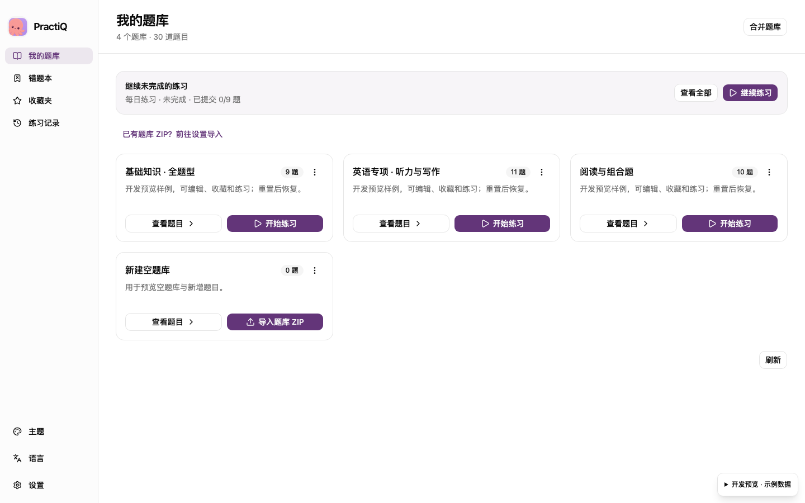

<p align="center">
  
</p>

# PractiQ

[English](README.md) | 简体中文

把文档变成题库，在 macOS、Windows 或 Android 上离线练习、自测和模考。

- **导入与复核**：用 AI 提取文档中的题目，检查质量提示，整理题库。
- **练习与组卷**：跨题库按题型、错题、收藏或未做题筛选，进行练习、自测或限时模考。
- **查看评分**：客观题本地判分，简答题可主动请求 AI 评分，也可人工改分。
- **保存与分享**：断点续练、备份个人记录，将题库连同图片和音频导出为 ZIP 分享。

应用支持简体中文和英文、明暗主题、七种基础题型，以及英语听力、阅读、完形填空、翻译和写作等题型。练习数据保存在本机，无需账号，不提供云同步。

首次启动按系统语言偏好选择支持的语言，也可从侧边栏切换。语言选择保存在本机并包含在完整备份中，保存失败后可重试；日期和数字使用与界面语言匹配的系统区域偏好。切换语言会保留题目原文和作答，有可靠语言信息的材料会声明自身语言，供辅助工具使用。AI 评分在开始时记录反馈语言，继续同一次请求会保留该语言。

作答、自评、草稿保护、失败重试、语言设置和主动 AI 评分的详细规则见[练习指南（英文）](docs/practice-guide.md)。

PractiQ 仍处于开发阶段，目前没有已发布的 GitHub Release；请按下方步骤从源码运行。平台构建检查不代表已完成签名发布或干净系统验收。



开发预览，使用内存示例数据。

## 先体验：无需配置模型

[运行桌面应用](#运行桌面应用)后：

1. “我的题库”为空时，点击**添加示例题库**；也可通过**设置 → 恢复备份 → 导入题库 ZIP** 导入 [sample.zip](app/fixtures/sample.zip)。
2. 打开题库，选择**开始练习**，体验即时反馈练习、不限时自测或限时模考。
3. 提交作答，查看评分和解析。

全程无需 API Key。人工编写的样例用于展示题型和待复核标记，不代表模型效果。更多样例：[复合题](app/fixtures/composite.zip)、[全题型](app/fixtures/all-types.zip)。

从题库卡片菜单导出 ZIP，可分享题目而不包含个人作答和评分。导入题库会追加内容；恢复完整学习数据备份会在确认后替换个人数据。详见[题库包指南](docs/question-bank-package.md)。

## 用 AI 导入文档

文档导入在独立 AI 服务的 Web 前端完成：

1. [启动独立 AI 服务](#独立运行-ai-服务)，打开 Web 前端，填写服务访问令牌。模型配置及供应商密钥留在服务端。
2. 一次选择最多 10 份源文件，主动点击**开始导入**。只选择文件不会上传或调用模型。
3. 查看任务进度、保存的题目、图片、原文答案与待复核提示，下载题库 ZIP。
4. 在桌面 app 中通过**设置 → 恢复备份 → 导入题库 ZIP**新建题库或追加到已有题库。

服务支持 **PDF、TXT、CSV 和 PNG/JPEG**；部署端配置 LibreOffice 后，还可导入 **DOC、DOCX、XLS、XLSX**。Office 规范化由服务执行，默认转为 PDF，也可导出文本，包含 Excel 隐藏工作表。桌面安装包不再内置 Python 服务或 LibreOffice。部署方式与保真边界见[Office 指南](server/docs/desktop-office.md)。

任务历史、暂停、中断、恢复、失败单元重试、部分结果复核与重新解析均在 Web 前端处理。读取结果、复核和下载 ZIP 不调用模型；恢复、重试及重新解析须主动触发，可能产生费用。详见[导入任务指南](docs/import-tasks.md)。


截图来自本机只读 AI 服务实际提供的 Web 构建产物；任务数据库为空，未配置模型。选择示例文件没有上传或调用模型。

解析只提取原文已有答案与评分细则，不替缺答案的题目解题；缺失内容保留待复核标记。请在 **180 天**内下载需要保留的结果，任务到期不影响已导入 app 的题库。

练习和本地判分可离线使用。需要主观题 AI 评分时，在桌面**设置 → AI 服务**中配置独立服务地址及访问令牌，再主动开始评分或重试。评分须有参考答案或评分细则；缺少依据、失败或结果未知时保持未判定。此功能用于个人练习，不作为正式考试阅卷依据。打开 app 或修改设置不会调用模型。

app 访问令牌保存在 macOS Keychain、Windows Credential Manager 或 Android Keystore 保护的私有存储中，Web 令牌只保存在浏览器内存中。服务地址保存在独立的 `v4/service-settings-v1.sqlite` 中，完整备份可包含版本化的地址设置，但不含凭据及 AI 任务状态；练习数据库仍为 schema 11。恢复和兼容边界见[数据模型](docs/question-model.md#versions-and-directories)。旧模型配置与密钥原样保留，不会自动作为独立服务凭据使用。限时模考在关闭应用或电脑休眠后仍继续计时，重新进入超时考试时按最后保存的答案交卷。

开发模式默认使用内存示例数据；预览面板可切换场景或选择真实本地数据，详见[开发预览](app/docs/development-preview.md)。

## 运行桌面应用

桌面数据使用新的 `v4/` 目录和 SQLite schema 11。旧目录（包括 `v3/`）原样保留，旧版完整备份不再接受；当前题库 ZIP 仍可导入。详见[数据格式边界](docs/question-model.md#versions-and-directories)。

app 支持 macOS 14+（Apple Silicon）、Windows 10/11（x64）和 Android 8+（API 26+，arm64 APK）。Linux app 安装包已移除；Linux 仍可作为 AI 服务和 CI 主机。CI 检查 macOS/Windows 安装包、Android APK 与 API 35 模拟器；实体设备、最低系统版本和签名发布仍需分别验收。

开发需要 Node.js 22.12+ 和 Rust。打包准备及共享契约检查还需要 uv 与已有 Python 3.14+ 解释器；Python 仅作为构建工具，不随桌面包分发。请安装 [Tauri 平台前置依赖](https://v2.tauri.app/start/prerequisites/)：macOS 使用 Xcode，Windows 使用 MSVC 构建工具和 WebView2。Android 还需要 JDK 21、SDK 36 和 NDK 28.2.13676358，详见 [Android 指南](app/docs/android.md)。不创建项目 `.venv`。

克隆仓库并进入根目录：

```sh
git clone https://github.com/shenyankm/PractiQ.git
cd PractiQ
```

macOS 从仓库根目录执行，并替换 Python 路径：

```sh
make install-locked AI_PYTHON=/path/to/python3.14
make app-install
cargo fetch --locked --manifest-path app/src-tauri/Cargo.toml
make app-dev AI_PYTHON=/path/to/python3.14
# 构建本地应用安装包：
make app-build AI_PYTHON=/path/to/python3.14
```

Windows 使用 PowerShell：

```powershell
npm --prefix app ci
cargo fetch --locked --manifest-path app/src-tauri/Cargo.toml
python app/scripts/prepare-package.py
cd app
npm run desktop
# 构建 Windows 安装包：
npm run tauri -- build
```

`prepare-package.py` 使用 Python 3.14+，生成构建元数据与 Cargo/npm 许可声明，不下载或复制文档处理运行时。产物位于 `app/src-tauri/target/release/bundle`：macOS 为 `.app`/`.dmg`，Windows 为 NSIS `.exe`。Android APK 使用单独的[构建与模拟器命令](app/docs/android.md)。打包检查验证版本、许可声明及没有内置引擎；它不代表已验证签名或桌面音频播放。

## 独立运行 AI 服务

独立服务通过 Web 前端及 API 提供文档导入，也为桌面 app 提供显式评分。需要 Python 3.14+、uv、用于 Web 构建的 Node.js 22.12+，以及支持文本和图片输入的模型。复制配置模板，保留已有设置：

```sh
cp -n .env.example .env
```

在 `.env` 中设置服务令牌、模型凭据、`LLM_MODEL`、PostgreSQL 连接地址 `DATABASE_URI` 和文件存储。先创建空的专用 PostgreSQL 数据库，再初始化服务表并启动：

```sh
make install-locked AI_PYTHON=/path/to/python3.14
make init-db AI_PYTHON=/path/to/python3.14
make web-install
make web-build
make server-dev AI_PYTHON=/path/to/python3.14
```

FastAPI/LangGraph 服务监听 `127.0.0.1:8090`，使用 PostgreSQL 和本地文件存储，每个数据库只运行一个进程。上传、任务、素材和评分接口均需鉴权。打开 `http://127.0.0.1:8090/` 使用已构建的 Web 前端；开发时可另外运行 `make web-dev`，其本机 Vite 服务将 API 请求代理到独立服务。需要 Office 支持时，仅在服务部署端配置 `AI_OFFICE_EXECUTABLE` 与 `AI_OFFICE_VERSION`。详见[服务指南](server/docs/service-guide.md)。

## 文档与开发

[文档索引（英文）](docs/README.md)区分使用指南、技术参考、验收工作表和历史证据。

- [文档任务 API](server/docs/document-tasks.md)：进度、暂停、恢复、重试与复核
- [部署与运维](server/docs/operations.md)：部署、存储与恢复
- [单机部署验证](docs/operations-single-machine-20261009.md)：隔离资源配额、替身模型过载、故障恢复与备份还原
- [10 月 9 日工程证据](docs/engineering-optimization-20261009.md)：采纳与撤销的候选、独立产物测量及真实模型失败边界
- [效果评测](server/docs/evaluation.md)：数据集、检查与证据边界
- [Web 资源测量](docs/performance-web-fonts-20261009.md)：完整静态资源体积、构建样本与字体验证
- [评分格式实验](docs/performance-grading-arrays-20261009.md)：固定真实模型样本、调用用量与撤销的候选
- [产物校验测量](docs/performance-payload-check-20261009.md)：复用存储与 Office 校验，测量事件循环调度
- [服务 Web 构建测量](docs/performance-build-once-20261009.md)：每次镜像构建只构建一次 Web，本地配对耗时与产物一致性
- [服务构建工具锁定](docs/service-build-tools-20261009.md)：精确后端约束、审计及源码和许可证归档验证；未完成任务保留原部署恢复
- [题型模型](docs/question-model.md)：题型与复合题规则
- [发布验证](CONTRIBUTING.md#release-verification)：发布检查与验收证据
- [发布规范](docs/releases.md)：版本标签、下载产物、校验值与手动草稿流程
- [参与贡献](CONTRIBUTING.md)：开发检查与提交规范

桌面检查运行 `make app-check`，导入 Web 前端检查运行 `make web-check`，AI 服务检查运行 `make verify`。Playwright Test 覆盖双语交互、浏览器预览和富内容渲染，模拟原生命令，不调用模型：

```sh
cd app
npx playwright install chromium --only-shell
npm run test:browser
```

测试运行器自动启动本机回环地址上的 Vite 服务。可运行 `npm run test:preview` 或 `npm run test:rich-content` 单独检查。失败时，执行轨迹和截图保存在 `app/test-results/browser/`；用 `npx playwright show-trace /path/to/trace.zip` 查看轨迹。

## 获取帮助与参与贡献

通过 [GitHub Issues](https://github.com/shenyankm/PractiQ/issues/new/choose) 报告可复现问题或提出改进建议。代码和文档贡献见[贡献指南](CONTRIBUTING.md)；漏洞请按[安全策略](SECURITY.md)私密报告。

项目源码使用 [MIT 许可证](LICENSE)，内置依赖保留各自的[上游许可声明](app/licenses/README.md)。
