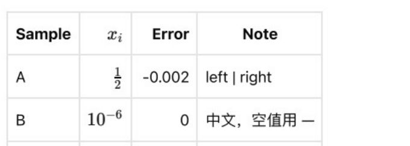
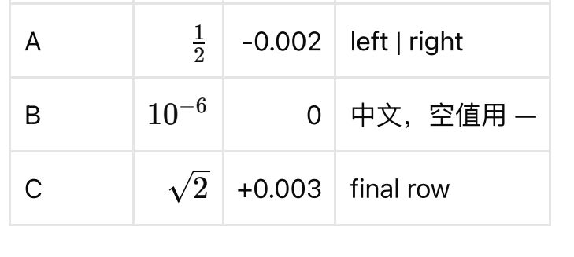

# PractiQ 全格式 AI 导入中文验收报告

> Historical evidence. This records the 2026-09-29 embedded-service baseline. Later retests linked below are also historical; neither report establishes current independent-service quality. See the [documentation index](README.md) for current guides.

> 后续修复及最新复测见 [修复与复测报告](ai-import-repairs-20260929.zh-CN.md)。本页保留首次验收基线，不覆盖原始失败结果。

验收日期：2026-09-29（Asia/Singapore）

模型：`qwen3.7-flash`

结论：**未通过。10 份输入全部实际调用模型，6 份失败、4 份部分成功，完整通过 0/10。**

## 范围与判定标准

本轮使用当前 macOS 发布应用所带的 Python 服务，读取用户授权的 `.env` 模型配置，在独立本地目录启动服务，通过鉴权 HTTP 完成上传、建任务、队列执行、结果读取及无凭据重启检查。没有模拟模型响应，没有修改提示词或产品代码来改善此次成绩，没有把预期答案填入实际结果。

TXT、CSV、PDF、扫描 PDF、PNG、JPEG 直接提交。DOC、DOCX、XLS、XLSX 使用上一轮由应用内置 Office worker 实际生成的 PDF；提交前逐一复核原文件及转换 PDF 的 SHA-256，确保对应同一份测试集。Word 转换为 4 页，XLSX 为 14 页，XLS 为 16 页；Excel 包含额外空白页，不将空白页判为漏题。

每份文件覆盖 16 类题型，预期 25 条结构化记录，其中 6 条为材料父项、19 条为可作答项。完整通过要求：保留全部题目、答案和材料关系；不编造答案及语言方向；公式、表格、图片内容及关联正确；仅有 `COMPLETED` 不算通过，必须同时检查 `status` 和内容。

**本轮是打包服务与实际模型的解析验收，不是重新逐项操作桌面界面、导入正式题库并完成练习的端到端验收。** 未向日常题库写入这些不完整结果。Windows/Linux 未运行。听力材料有文字稿但没有音频，此轮不验收音频播放。纯 TXT/CSV 的图片引用不会被自动解引用，不能要求它们产生不存在的内嵌图片。

## 正式逐格式结果

耗时取同一任务服务日志的首末事件间隔，包含其处理及重试，不含人工选择文件、Office 转换、题库导入时间；并发运行下不作为单文件性能基准。Token 列为输入 / 输出。

| 输入 | 运行结果 | 返回记录 / 预期 | 耗时（秒） | 模型调用 | Token | 主要失败代码 |
| --- | --- | ---: | ---: | ---: | ---: | --- |
| TXT | 失败 | 0/25 | 162.4 | 2 | 22,264 / 19,625 | OUTPUT_STALLED；DOCUMENT_PARSE_FAILED |
| CSV | 失败 | 0/25 | 261.3 | 4 | 52,383 / 33,008 | OUTPUT_STALLED；DOCUMENT_PARSE_FAILED |
| PDF | 部分成功 | 1/25 | 144.5 | 13 | 192,932 / 25,296 | OUTPUT_STALLED |
| 扫描 PDF | 失败 | 0/25 | 128.6 | 11 | 161,850 / 24,136 | OUTPUT_STALLED；DOCUMENT_PARSE_FAILED |
| PNG | 失败 | 0/25 | 146.5 | 3 | 40,997 / 20,293 | OUTPUT_STALLED；DOCUMENT_PARSE_FAILED |
| JPEG | 失败 | 0/25 | 136.2 | 3 | 41,247 / 18,903 | OUTPUT_STALLED；DOCUMENT_PARSE_FAILED |
| DOC | 部分成功 | 2/25 | 67.3 | 8 | 114,317 / 17,323 | OUTPUT_STALLED |
| DOCX | 部分成功 | 1/25 | 102.1 | 10 | 145,164 / 23,277 | OUTPUT_STALLED |
| XLS | 失败 | 0/25 | 225.2 | 37 | 546,969 / 34,948 | OUTPUT_INVALID、OUTPUT_STALLED；TASK_EXECUTION_FAILED |
| XLSX | 部分成功 | 5/25 | 199.4 | 37 | 544,821 / 36,219 | OUTPUT_INVALID、OUTPUT_STALLED |

正式验收合计 **128 次调用，输入 1,862,944 token、输出 253,028 token，共 2,115,972 token**；这 10 个正式任务均无未知用量调用。未配置价格，不能据此给出准确费用。该统计不含此前中断诊断尝试的额外消耗。

总共只返回 **9 条记录 / 250 条预期记录**，其中没有材料父项。9 条均为可作答项，对应 190 个预期可作答项的返回数量比例约 4.7%；这只是完整性计数，**不是答案正确率或模型通用能力评分**。

## 题型核对

| 题型 | 本轮实际可见结果 | 判定 |
| --- | --- | --- |
| 单选 | XLSX 保留 `2 + 3`，选项 4/5/6，答案 B | 该样本内容正确，其他格式未覆盖成功 |
| 多选 | XLSX 保留质数选项，答案 A、B，multiple 模式 | 该样本内容正确 |
| 判断 | XLSX 保留冰点判断，答案 true | 该样本内容正确 |
| 填空 | 未返回 `12 + 8` 的有效题目 | 未通过 |
| 简答 | 蒸发题未返回；PDF/DOCX 返回行列式题，答案 −2 | 不完整；富内容另有缺陷 |
| 排序 | 未返回有效题目 | 未通过 |
| 连线匹配 | 未返回有效题目 | 未通过 |
| 阅读理解 | 未返回材料父项及子题 | 未通过 |
| 选词填空 | 未返回共享选项与子题 | 未通过 |
| 完形填空 | 未返回材料父项及子题 | 未通过 |
| 听力 | 未返回文字稿父项与选择子题 | 未通过；缺少音频不等于允许丢失文字题 |
| 语法填空 | 未返回提示 read 与答案 reading | 未通过 |
| 选句填空 | 未返回句子选项、空位与子题 | 未通过 |
| 段落匹配 | 未返回段落及 many-to-one 关系 | 未通过 |
| 翻译 | DOC/XLSX 均保留中译英答案、10 分和评分依据；XLSX 把中文原文用作题干 | 内容主要保留；题干表达不同不直接当作错译 |
| 写作 | DOC/XLSX 保留 80–120 词、15 分、评分依据、空答案；XLSX 目标语言 en，DOC 为 null；另一道短邀请写作题未返回 | 不完整；DOC 丢失明确的目标语言 |

评分器采用规范化题干匹配，会把 XLSX 的中文翻译题干与原预期英文指令视为不匹配。人工复核确认其中文原文、英文参考答案和翻译方向相符，故不把这条匹配差异当成翻译语义失败，也未反向修改金标准来抬高分数。主要失败结论由大量缺失记录及下述可见缺陷直接支持。

## 公式、表格、图片复核

只有普通 PDF 和 DOCX 返回了富内容题；其他输入没有可用的对应题目。

- **PDF：**矩阵及逆矩阵、积分、级数、分段函数进入公式块；答案 −2 保留。表格 Markdown 中中文、负号、科学计数法、单元格内转义竖线和末行 C 均保留。表格与曲线关联到该题。但表格被错误标为 `role=answer`，表格裁图漏掉表头，曲线裁图上沿还截到了标题。
- **DOCX：**答案 −2、积分、级数、分段函数保留。矩阵及逆矩阵只存在于 `sourceText`，没有进入 `contentBlocks` 公式块；不能把原文记录仍有文字当作题目呈现完整。表格 Markdown 完整，但表格及其视觉元素都被标为 `role=answer`。表格裁图漏掉最后一行 C。
- 两个结果都把富内容题标为 `needsReview=false`，整体 `confidenceScore=100`。这些值与人工看到的缺陷不符，不能用于替代实际验收。
- 4 份部分结果共保留 25 个文件引用（按各任务内 objectKey 去重）：大小、SHA-256 和图片解码校验均通过。但文件完整性通过不代表裁图语义完整。
- 失败页以“未完成识别的原页”保留，且没有伪造题目关联。这是有效的人工复核退路，不能计入题目识别成功数。

DOCX 表格裁图：缺失末行 C（原表应有 A/B/C 三行）。

PDF 表格裁图：A/B/C 三行保留，但缺失表头。

完整对照页可见 `app/fixtures/ai-import/formats/resources/preview.png`。曲线实际裁图保存在同一证据图片目录。

## 问题与修复优先级

1. **P1：结构化输出频繁无法通过校验，导致整页或整份文档丢失。** 正式任务多次出现 `OUTPUT_INVALID`，并因重复同类校验失败触发 `OUTPUT_STALLED`。日志包含 `questions/*` 的 `value_error`、`missingFields` 和 `questionKind` 的枚举错误。应先用已保存的失败响应/检查点定位输出与契约的具体不一致，再回归全部 16 类题型；不能仅提高重试次数或放松契约校验。
2. **P1：材料与答案角色分配错误。** 富内容材料表格被归为 `answer`，而桌面考试会隐藏答案角色内容；会有把题目材料隐藏的风险。应以原文用途校核 role，并添加材料表格不可误归答案的回归。
3. **P1：裁图缺内容、公式仅留在原文记录。** 需要验收裁剪框是否覆盖完整表头、末行和图标题，并检查 sourceText 中的关键公式是否进入可展示内容。SHA-256 和 JSON schema 无法发现这些错误。
4. **P1：XLS 返回 `TASK_EXECUTION_FAILED`，没有对外结果。** 已有逐页失败记录，但最终没有部分结果可核对。应沿该 threadId 的服务/检查点调查汇总阶段；现有公开失败信息不足以证明具体根因，不能武断归咎于 Office 转换或某个模型字段。
5. **P2：明确的写作目标语言丢失。** DOC 样本仍保留“in English”指令，却输出 `targetLanguage=null`。字段需与原文证据交叉检查。
6. **P2：重试成本偏高且没有带来完整结果。** XLS/XLSX 各 37 次调用，输入 token 分别超过 54 万。先修正可复现契约问题，再评估邻页上下文、重复失败提前停止和分块；本次不据单次混合文档运行给出稳定性能指标。

本轮为验收与报告，没有实施这些产品修复。再次放行至少需要：10 份全部无漏题；材料关系正确；无补答案；公式、表格和图片逐项通过；完成桌面实际导入及练习显示复核。单次成功也不等于三次稳定性通过。

## 运行有效性与证据

验收脚本最初把 TXT 类型写成 `txt`，而接口要求 `text`，触发 422 并中断当时的 7 个任务。恢复后观察到保留的重试预算影响结果。因此：**这 7 份全部以新任务无中断重跑；正式表格只使用新任务结果。** TXT、XLS、XLSX 使用其原先完整且无中断的任务。中断/恢复结果另存 `interrupted-diagnostic/`，不混入正式通过率和用量；它们仍产生过额外调用，不能视为免费。

正式 10 个任务结束后，以空模型凭据重启同一隔离服务，逐项读回：10/10 状态、题目数量及已记录用量保持一致，无新增模型调用证据。原文件及 Office 转换产物在提交前均验证哈希。运行环境、发布可执行文件哈希、评分器哈希和工作区 dirty 状态均已保存；没有声称这是干净提交或三平台发布验收。

本地原始证据位于 `server/reports/checks/all-formats-live-20260929/`（Git 忽略目录）：

- `report.json`：正式任务、输入哈希、用量及重启结果。
- `assessment.json`：重新按统一金标准评分、逐条题目、失败单元、视觉元素与图片完整性检查。
- `*-state.json`：10 份完整服务返回状态，包含 threadId、失败代码和 usage。
- `expected.json`、`environment.json`：预期结构与运行身份；没有保存 API Key。
- `service.log`、`runtime/`：事件与独立 SQLite/文件存储；日常桌面题库未改动。
- `run_live.py`、`assess.py`：复跑/核对脚本；模型凭据仅运行时读取。已有正式 report 会跳过完成任务，重复质量试验应使用新的输出目录与任务，并明确其成本。

截图证据随本报告保存在 `docs/assets/ai-import-all-formats-20260929/`。此前基础样本的桌面验收见 `docs/ai-import-acceptance-20260929.md`；其少量成功不能替代本次全题型混合测试的失败结论。
