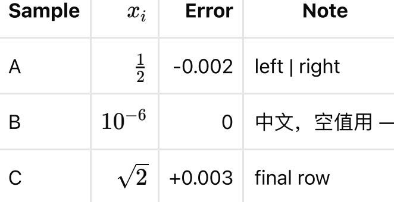

# PractiQ AI 导入修复与复测报告

日期：2026-09-29。模型：`qwen3.7-flash`。原始基线见 [全格式验收报告](ai-import-all-formats-acceptance-20260929.zh-CN.md)。

本次代码改动覆盖原报告六项优先级，并落实追加要求：**缺答案、缺题干、缺题目允许导出，通过结构化字段标记，供后续处理。** 这不等于识别质量全部通过；缺失内容不能靠自动补答案或删除校验来“修好”。

## 导出规则与桌面实测

- `questions[].missingFields`：题目级缺失，例如 `stem`、`answerPayload`、`options`、`material`、`media`；原值保持 `null`，`needsReview=true`。
- `result.missingFields`：文档级缺失，使用 `questions`、`media`。已知失败单元、提取截断或零题目会标记缺题目。
- `processing.failures`：保留失败阶段、单元索引、原因及重试资格。部分结果和零题目结果均可返回 `PARTIAL`，而不是因内容缺失阻断导出。
- 缺失标记不代表已经找到所有漏题：模型可能在没有报错时静默漏题；空标记不能当作完整性证明。未知用量、损坏资源、越权文件访问和不合法结构仍按各自边界处理。
- 题库 ZIP 保留题目级空值和缺失字段；文档级标记通过既有警告存储中的稳定机器代码保存，再导出为 `missingFields`。无需迁移桌面数据库。零题目题库的文档级图像和缺题标记也有导出/重导入测试。

在重新构建的 macOS 桌面应用中，实际导入 `Acceptance-20260929-Incomplete` 合成题库并通过界面导出 ZIP：界面显示两题待复核，允许确认导入及导出；解包检查确认第一题题干为空但原有答案保留，第二题参考答案为空，题目缺失标记与文档 `missingFields=["questions"]` 均保留。未把参考答案填入无答案题。

桌面原生选择器一度没有真正选中文件；使用键盘选中后正常打开，没有修改文件过滤规则。验收题库新增两道合成题，保留在应用中供检查，原有题库未替换。原生导出证据：`server/reports/checks/missing-export-ui/native-export.zip` 与 `verification.json`。

## 按优先级实施的改动

| 优先级 | 改动 | 验证范围与限制 |
| --- | --- | --- |
| P1 结构化输出 | 模型侧只强制核心证据字段，不强制填写所有题型无关字段；匹配题明确左右侧及独立编号；合法的字符串化 JSON 数组解码后重新严格校验；规范化可推导的缺失标签和无适用意义的计数；增加复杂材料题提示与错误反馈 | 公开导入契约保留严格业务校验；并未保证模型覆盖所有题目。跨页材料在合并后校验，避免把续页误判为完整独立材料 |
| P1 材料/答案角色 | 图表单独复核，依据图中可见证据校正角色；表头匹配允许公式的 LaTeX/可见文本写法不同；裁图未确认完整时，角色仍可独立修正；显式答案表头继续受保护 | 图表题统一保留待复核标记；二次模型意见不当作人工验收通过 |
| P1 公式/裁图 | 检查原文记录中的关键显示公式是否出现在可展示内容；遗漏标记 `material`；复核表头、末行、标题和坐标轴；未通过的裁图不发布，保留完整原页及 `CROP_UNVERIFIED` | 公式缺失不再抛错丢弃整题；裁图语义完整性仍需要人工检查 |
| P1 XLS 汇总失败 | 原因定位为普通题被引用成材料父项；最终关系错误映射回来源单元，保留可用部分并暴露失败详情；全失败也返回带缺失标记的结果 | 不将所有模型或服务错误都归因于 Office；损坏存储等执行错误仍不吞掉 |
| P2 写作目标语言 | 明确 `in English` 等方向的字段说明；写作字段遗漏时从明确英文写作指令保守保留 en/zh；无方向或其他语言仍不猜测 | 无答案、分值、词数等信息不会随之编造；已有语言标签不覆盖 |
| P2 调用成本 | 减少无关字段和无效纠错；保留重复输出提前停止；图表复核共享现有每单元最多四次调用预算，并纳入成功/失败用量及恢复测试 | 没有提高预算或更换更强模型；成本变化按同一测试集实测，不作稳定性能承诺 |

原生 JSON Schema 做过对照试跑，仍出现漏题和语义错误，未切换默认协议。最终仍为 `function_calling`。

## 工程验证

- `make verify`：锁文件、Ruff、Pyright、30 个评测样本校验、714 个测试通过，2 个非本机平台测试跳过；总覆盖率 92%；恢复探针和 Python 包构建通过。
- `make app-check`：共享契约检查通过，前端 227 项测试通过；Rust 134 项通过、3 项忽略，格式检查和 Clippy 通过。
- macOS `.app`、`.dmg` 重新构建；真实复测启动发布包内的服务。全格式复测包与当时源码一致；复测后写作语言修复另行运行工程验证并重新打包。
- 契约新增字段同步生成 Rust JSON Schema 和 TypeScript 类型；题库导出/重新导入测试覆盖缺题干、缺答案、零题目和无题目关联的文档图像。
- `text-no-questions` 样本由预期报错改为明确预期 `PARTIAL`＋缺题字段，这是用户要求导致的验收规则变化；全格式测试的 25 条金标准记录及答案未修改。

## 最终全格式真实模型结果

**完整识别验收：0/10 通过。** 十个任务均完成并返回 `PARTIAL`，返回记录共 60/250；记录可能包含重复，不能把这个比例当成召回率。缺失导出规则通过，不代表题目识别通过。

| 格式 | 返回记录 / 25 | 调用次数 | 输入 token | 输出 token | 状态 |
| --- | ---: | ---: | ---: | ---: | --- |
| DOC | 14 | 7 | 106,404 | 11,973 | PARTIAL |
| DOCX | 2 | 8 | 112,391 | 14,200 | PARTIAL |
| CSV | 0 | 2 | 23,831 | 16,084 | PARTIAL |
| PDF | 9 | 7 | 101,273 | 16,741 | PARTIAL |
| TXT | 0 | 2 | 23,912 | 16,102 | PARTIAL |
| SCANNED-PDF | 6 | 8 | 119,261 | 19,776 | PARTIAL |
| PNG | 0 | 3 | 49,971 | 26,914 | PARTIAL |
| XLS | 20 | 30 | 424,668 | 20,727 | PARTIAL |
| JPG | 0 | 4 | 66,722 | 32,082 | PARTIAL |
| XLSX | 9 | 29 | 417,161 | 30,026 | PARTIAL |

共 100 次已知调用，未知用量 0；输入 1,445,594、输出 204,625，共 1,650,219 token。相较原始基线 128 次调用、2,115,972 token，本轮调用减少约 21.9%，token 减少约 22.0%。这只是本轮同集对照，不能保证下一次模型输出与成本相同。

实际改善：XLS 从汇总致命失败变成保留 20 条部分结果；最终 DOCX/PDF/XLS 中材料表格的角色为 `material`；矩阵和逆矩阵在部分 PDF/Office 结果中可展示。10 个任务在不提供模型凭据的只读重启后，状态、题目数量和调用用量均保持一致。

仍未通过的项目，按原优先级保留：

1. **P1 全题型完整性**：TXT、CSV、PNG、JPG 返回零题目；其余格式仍漏题或材料层级不完整，部分单元仍为 `OUTPUT_INVALID` / `OUTPUT_STALLED`。当前模型与提示调整尚未解决全部结构化输出问题。
2. **P1 图像完整性**：图表复核后仍有表格右边缘或外框裁切；模型认可不能替代人工检查。对应题目保留待复核，不宣称裁图全部通过。
3. **P1 公式保真**：部分公式已保留，但 XLSX 仍有不完整公式结构；存在答案仅出现在内容块、正式答案字段仍缺失的情况，继续保留缺失标记。
4. **P2 写作语言**：最终真实运行的 XLSX 指令只保存在 `scoreSourceText`，目标语言仍为空。复测后补入这一路来源证据并增加失败再通过的回归测试；将捕获的真实 XLSX q6 输出离线重放后，目标语言由 null 恢复为 en、答案仍为 null，证据为 `server/reports/checks/import-repair-writing-replay.json`。此项属于确定性修复，没有篡改真实运行原始结果，也未把它计作全格式通过。

实际导出的 PDF 表格裁图（可见右侧边界问题）：

因此，本报告交付的是已实现并验证的修复以及仍未通过的真实证据，**不是“全部修复完成”的结论**。

## 证据与边界

最终记录：`server/reports/checks/all-formats-repaired-final-20260929/`，含输入及可执行文件哈希、工作区源码哈希、10 份完整状态、调用用量、重启结果、原图与模型检查点。评分与核对脚本保存在同级 `run-import-repaired-final.py`、`assess-import-repaired.py`。没有保存 API Key。

中间试验单独保留为 `import-repair-probe-v1` 至 `v6`，以及角色比对最后一次修正前的 `all-formats-repaired-20260929/`。这部分共 159 次已记录调用、输入 2,183,491 token、输出 375,347 token，不计入最终结果表，也不是零成本。原始失败基线不覆盖。

真实模型全格式复测走发布包服务的鉴权上传/任务接口；桌面界面实测覆盖不完整内容题库导入和 ZIP 导出，不能说十份混合文档全部完成了界面练习验收。Windows/Linux 干净机、独立人工评分锚点、正式签名/公证未验证。没有提交或推送工作区修改。
