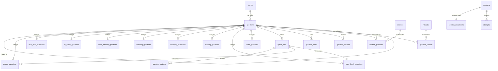

# 题型、关系表与 JSON 契约

契约来源为 [`contracts.py`](../server/src/practiq_ai/contracts.py)，实际建表 SQL 为 [`schema.sql`](../app/src-tauri/src/schema.sql)。`app/scripts/export-contracts.py` 导出 Rust 使用的 `app/src-tauri/contracts.json` 和前端 `app/src/contracts.generated.ts`；`--check` 拒绝过期生成文件。完整普通题与复合题样例分别见 [`sample.json`](../app/fixtures/sample.json)、[`composite.json`](../app/fixtures/composite.json)。

## 版本与目录

仅接受 `schemaVersion: 2` JSON（裸结果或任务输出中的 `result`），SQLite `user_version=9`，备份清单 `version=3`。桌面在系统应用数据目录的 `v2/` 中启动；不迁移、覆盖或删除旧根目录数据库、图片及 AI 工作目录。旧 JSON、旧备份和非 9 数据库明确拒绝。Python 执行状态版本为 5，旧结构 checkpoint 不可恢复，应重新解析源文件。

## ER 图

`questions` 只保留公共字段，不含 `snapshot`。已知题型必须且只能有一张匹配的专表记录；未确定题型保存原文及审核状态，不自动判分。外键保证父子、词库、素材关系；Rust 的统一写入边界校验题组和专表一致性。

## 表字段

| 表 | 字段与含义 |
|---|---|
| `questions` | `id` 主键；`bank_id`、`import_id`；`parent_id` 可空父题；`position` 原文顺序；`stem`、`mode`、`question_type`；`analysis`、`source_text`；`source_score`、`scoring_rubric`、`score_source_text` 原卷依据；`content_blocks` 结构块；`confidence`、`needs_review`、`missing_fields`；`favorite` |
| `choice_questions` | `question_id` 主外键；`variant` single/multiple；`option_set_id`；`correct` 经校验的 JSON 数组或 JSON null |
| `true_false_questions` | `question_id`；`value` JSON 布尔或 null |
| `fill_blank_questions` | `question_id`；`blank_count` 原文空位数；`answers` 按空排列的 JSON 数组或 null |
| `short_answer_questions` | `question_id`；`answer` JSON 文本或 null |
| `ordering_questions` | `question_id`；`answer_order` 题项 ID 数组或 null |
| `matching_questions` | `question_id`；`variant` one_to_one/many_to_one；`matches` 左右 ID 对数组或 null |
| `reading_questions` | `question_id`；`passage` 文章结构块 |
| `word_bank_questions` | `question_id`；`passage` 含显式空位引用；`allow_reuse`；`option_set_id` 共享词库 |
| `cloze_questions` | `question_id`；`passage` 含显式空位引用 |
| `option_sets` | `id` 指向拥有词库的题目；每组词库只保存一次 |
| `question_options` | `owner_id`、`position` 联合主键；`label`、`content`；同词库标签唯一 |
| `question_items` | `question_id`、`position` 联合主键；`item_id`、`side`、`content`；用于排序与匹配 |
| `sections` / `section_questions` | 章节 `id,bank_id,title,instructions`；`section_id,question_id` 成员关系。章节不是必须整组作答的复合题 |
| `visuals` / `question_visuals` | 素材 `id,bank_id,content,document_level`；`visual_id,question_id` 关联。`document_level` 明确标记文档级待确认素材；删除题目不会把失去关联的专属素材改挂到其他题 |
| `assets` | `hash,media,size,path`；图片内容存在不可变 `assets/<sha256>` 文件中 |
| `question_sources` | `question_id,stage,unit_index`；一个题目可关联多个原文页／分片 |
| `imports` / `import_warnings` | 导入 `id,bank_id,digest,created_at`，不另存一份题目 JSON；警告 `import_id,position,message` |
| `session_documents` | `session_id,content`；整场版本化不可变 JSON，题组父材料和共享词库各冻结一次 |
| `attempts` | `session_id,ordinal`；`question_id` 原题弱引用；`snapshot_question_id` 冻结子题 ID；`answer`、判分、时间、分值及评分记录。原题删除不影响快照 |

## JSON 示例

所有题目有唯一 `id`，用 `answerMode` 区分结构；下表只展示题型专属部分，共同字段及审核信息见完整样例。选项内容只在拥有者的 `options` 中出现，子题通过 `optionSourceId` 引用拥有者。导入时 Rust 为当前库分配新 ID，并统一重映射父子、素材、章节、空位及选项引用。

| 题型 | 专属 JSON |
|---|---|
| 单选 | `{"answerMode":"choice","choiceVariant":"single","options":[{"label":"A","content":"甲"},{"label":"B","content":"乙"}],"answerPayload":{"correct":["A"]}}` |
| 多选 | `{"answerMode":"choice","choiceVariant":"multiple","options":[{"label":"A","content":"甲"},{"label":"B","content":"乙"}],"answerPayload":{"correct":["A","B"]}}` |
| 判断 | `{"answerMode":"true_false","answerPayload":{"value":false}}` |
| 填空 | `{"answerMode":"fill_blank","blankCount":2,"answerPayload":{"answers":["甲",null]}}` |
| 简答 | `{"answerMode":"short_answer","answerPayload":{"text":"原文参考答案"},"scoringRubric":"原文明确的评分细则"}` |
| 排序 | `{"answerMode":"ordering","items":[{"id":0,"content":"甲"},{"id":1,"content":"乙"}],"answerPayload":{"order":[1,0]}}` |
| 匹配 | `{"answerMode":"matching","matchingVariant":"one_to_one","items":[{"id":0,"side":"left","content":"甲"},{"id":1,"side":"left","content":"乙"},{"id":0,"side":"right","content":"A"},{"id":1,"side":"right","content":"B"}],"answerPayload":{"matches":[{"left":0,"right":1},{"left":1,"right":0}]}}` |
| 阅读 | `{"id":"r","answerMode":"reading","passage":[{"partType":"text","textValue":"文章"}],"answerPayload":null}`；子题设置 `parentId:"r"`，允许既有题型及选词／完形，不允许再嵌阅读 |
| 选词 | `{"id":"w","answerMode":"word_bank","passage":[{"partType":"text","textValue":"文章"},{"partType":"blank","questionId":"w1"}],"options":[{"label":"A","content":"甲"},{"label":"B","content":"乙"}],"allowReuse":false}`；`w1` 为单选，`parentId`、`optionSourceId` 均为 `w`，`options:[]` |
| 完形 | `{"id":"c","answerMode":"cloze","passage":[{"partType":"text","textValue":"文章"},{"partType":"blank","questionId":"c1"}]}`；`c1` 为单选，`parentId:"c"`，使用自己的 `options` |

单选完整答案恰好一项，多选至少一项；重复标签、重复答案和失效引用拒绝。缺答案使用 null／部分数组，保留审核标记；不会补答案或改成错误。作答同样使用 `correct` 数组。空位与子题一一对应，不能从下划线或参考答案长度猜测。选词默认不重复，原文明确允许时为 true，编辑器可修正。

结果中的 `groups[].questionIds`、`visualElements[].questionIds`，以及 `processing.questionSources[].questionId` 和 `processing.quality.issues[].questionId` 都引用产物 ID。模型分片内部可使用局部下标，只有统一合并阶段负责最终 ID 分配与引用整理。

## 节点职责与业务边界

1. Python 格式读取提取文本／页面；共享文本分片与视觉解析使用同一 `ParsedQuestion` 契约，不为题型增加 Graph。
2. 合并阶段按来源位置处理重叠，整理父子、材料、空位和来源引用。跨页复合材料使用显式原始来源锚点；无法确认的关联保留原文和待审核标记，失败页保持文档级素材。
3. 校验后导出 JSON；任务计数按可作答子题，复合父题不重复计数。预算、重试、用量和恢复继续由现有执行层负责；解析不解题。
4. Rust `contract.rs` 校验导出 Schema 和引用；`questions.rs` 唯一映射关系表，供导入、完整题组编辑、复制合并和查询复用。图片写盘校验完成后再提交数据库引用。
5. Rust `paper.rs` 负责抽题、配额、分值和预览摘要；`exams.rs` 开始练习核对摘要、冻结整场内容并判分。前端只展示与输入，不实现另一套最终抽题／判分规则。
6. 简答 AI 评分仍需显式操作，从冻结快照取文章、必要素材和原文依据；交卷前 Rust 隐藏参考答案、解析、评分依据及可能泄题的原页引用。

## 组卷与历史

总题数以根题／完整题组为候选，按叶子数量做上限 1000 的子集动态规划。不能恰好满足时返回调整提示，不拆组。配额按根题型，例如单选 5 题、阅读 2 组；预览给出实际叶子数。随机仅改变根组顺序；组内保留原文次序。错题、收藏、未做筛选命中子题时带入完整题组。

默认分值精确到分，均分后的余数依子题顺序分配；父题没有分值。一次练习只写一个 `session_documents`，作答引用其中的叶子 ID。原题修改／删除、题库合并、备份恢复均不重写历史内容。

## 验证入口

- `app/fixtures/contracts.json`：Python 与 Rust 共用的合法／非法契约用例。
- `server/tests/test_composite_questions.py`：共享 Python 流程与桌面复合样例、跨页显式引用。
- `app/src-tauri/src/tests.rs`：真实临时 SQLite 导入、重建、整组抽取、词库约束、摘要失效、不可变历史及备份恢复。
- `make verify`、`make app-check`、`make app-build`：离线检查与 macOS 构建。模型替身通过不代表真实模型对新题型的识别质量；真实模型效果需单独测量。
