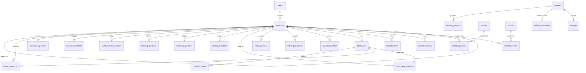

# Question types, relational tables, and JSON contracts

The contract source is [`contracts.py`](../server/src/practiq_ai/contracts.py), and the table definitions are in [`schema.sql`](../app/src-tauri/src/schema.sql). `app/scripts/export-contracts.py` exports `app/src-tauri/contracts.json` for Rust and `app/src/contracts.generated.ts` for the frontend; `--check` rejects stale generated files. Complete basic and composite examples are in [`sample.json`](../app/fixtures/sample.json) and [`composite.json`](../app/fixtures/composite.json).

The same script generates task-summary and review types, question-kind-to-answer-mode mappings, and composite classifications. Rust metadata is in `app/src-tauri/src/question_metadata.rs`. Add new types to the Python contract and regenerate instead of maintaining three separate classification lists. The database creates missing question-association and material-scope lookup indexes. Backups may omit these optional indexes, but any existing definitions must match exactly.

## Versions and directories

Only `schemaVersion: 3` JSON is accepted, either as a bare result or the `result` in task output. SQLite uses `user_version=10`, and backup manifests use `version=4`. The desktop starts in `v3/` under the system application-data directory. It does not migrate, overwrite, or delete databases, images, or AI working directories in the old root. Older JSON, backups, and databases with versions other than 10 are explicitly rejected. Python execution state uses version 6; older checkpoints cannot resume, so reparse the source files.

## Entity relationships

`questions` stores only common fields, with no `snapshot`. Every known answer mode must have exactly one matching subtype record. Unclassified questions retain source text and review state and are not automatically scored. Foreign keys enforce parent/child, option-bank, and material relationships; Rust's shared write boundary validates consistency between groups and subtype tables.

## Table fields

| Table | Fields and meaning |
|---|---|
| `questions` | Primary key `id`; `bank_id`, `import_id`; nullable parent `parent_id`; source order `position`; `stem`, `mode`, `question_type`, `question_kind`, `instructions`; `analysis`, `source_text`; source evidence `source_score`, `scoring_rubric`, `score_source_text`; structured `content_blocks`; `confidence`, `needs_review`, `missing_fields`; `favorite` |
| `choice_questions` | Primary/foreign key `question_id`; single/multiple `variant`; `option_set_id`; validated JSON array or JSON null `correct` |
| `true_false_questions` | `question_id`; JSON boolean or null `value` |
| `fill_blank_questions` | `question_id`; source blank count `blank_count`; ordered JSON array or null `answers` |
| `short_answer_questions` | `question_id`; JSON text or null `answer`; translation/writing languages, genre, and word-count bounds |
| `ordering_questions` | `question_id`; item-ID array or null `answer_order` |
| `matching_questions` | `question_id`; one_to_one/many_to_one `variant`; array of left/right ID pairs or null `matches` |
| `reading_questions` | `question_id`; passage content blocks in `passage` |
| `word_bank_questions` | `question_id`; `passage` with explicit blank references; `allow_reuse`; shared option bank `option_set_id` |
| `cloze_questions` | `question_id`; `passage` with explicit blank references |
| `listening_questions` | `question_id`; `passage`; `audio_ref`; start/end seconds, transcript, and exam play count |
| `gap_fill_questions` | `question_id`; `passage` with explicit blank IDs; one single-blank fill-in child per blank |
| `listening_playback` | `session_id,question_id`; used plays, progress, whether a play is unfinished, current playback start time, and accumulated playback milliseconds; pause/restart does not deduct another play |
| `option_sets` | `id` references the owning question; each option bank is stored once |
| `question_options` | Composite key `owner_id,position`; `label`, `content`; labels are unique within an option bank |
| `question_items` | Composite key `question_id,position`; `item_id`, `label`, `side`, `content`; used for ordering and matching |
| `sections` / `section_questions` | Section `id,bank_id,title,instructions`; membership `section_id,question_id`. Sections are not composite questions that must be answered as a unit |
| `visuals` / `question_visuals` | Material `id,bank_id,content,document_level`; association `visual_id,question_id`. `document_level` explicitly marks document-level material needing confirmation; deleting questions does not reassign orphaned question-specific material to other questions |
| `assets` | `hash,media,size,path`; image and audio bytes live in immutable `assets/<sha256>` files |
| `question_sources` | `question_id,stage,unit_index`; one question may reference multiple source pages/chunks |
| `imports` / `import_warnings` | Import `id,bank_id,digest,created_at`, without a duplicate question JSON copy; warnings `import_id,position,message` |
| `session_documents` | `session_id,content`; versioned immutable JSON for the entire session, freezing each parent material and shared option bank once |
| `attempts` | `session_id,ordinal`; weak source-question reference `question_id`; frozen child ID `snapshot_question_id`; `answer`, grading, timing, points, and grading records. Deleting a source question does not affect snapshots |

## JSON examples

Every question has a unique `id`; `answerMode` determines its structure. The table shows only type-specific fields; full samples contain common fields and review metadata. Chinese strings below are sample source content. Option content appears only in its owner's `options`; children reference the owner through `optionSourceId`. On import, Rust assigns new IDs for the current bank and remaps parent/child, material, section, blank, and option references together.

| Type | Type-specific JSON |
|---|---|
| Single choice | `{"answerMode":"choice","choiceVariant":"single","options":[{"label":"A","content":"甲"},{"label":"B","content":"乙"}],"answerPayload":{"correct":["A"]}}` |
| Multiple choice | `{"answerMode":"choice","choiceVariant":"multiple","options":[{"label":"A","content":"甲"},{"label":"B","content":"乙"}],"answerPayload":{"correct":["A","B"]}}` |
| True/false | `{"answerMode":"true_false","answerPayload":{"value":false}}` |
| Fill in the blank | `{"answerMode":"fill_blank","blankCount":2,"answerPayload":{"answers":["甲",null]}}` |
| Short answer | `{"answerMode":"short_answer","answerPayload":{"text":"原文参考答案"},"scoringRubric":"原文明确的评分细则"}` |
| Ordering | `{"answerMode":"ordering","items":[{"id":0,"content":"甲"},{"id":1,"content":"乙"}],"answerPayload":{"order":[1,0]}}` |
| Matching | `{"answerMode":"matching","matchingVariant":"one_to_one","items":[{"id":0,"side":"left","content":"甲"},{"id":1,"side":"left","content":"乙"},{"id":0,"side":"right","content":"A"},{"id":1,"side":"right","content":"B"}],"answerPayload":{"matches":[{"left":0,"right":1},{"left":1,"right":0}]}}` |
| Reading | `{"id":"r","answerMode":"reading","passage":[{"partType":"text","textValue":"文章"}],"answerPayload":null}`; children set `parentId:"r"` and may use existing basic types, word bank, or cloze, but cannot nest another reading parent |
| Word bank | `{"id":"w","answerMode":"word_bank","passage":[{"partType":"text","textValue":"文章"},{"partType":"blank","questionId":"w1"}],"options":[{"label":"A","content":"甲"},{"label":"B","content":"乙"}],"allowReuse":false}`; `w1` is single choice with both `parentId` and `optionSourceId` set to `w`, and `options:[]` |
| Cloze | `{"id":"c","answerMode":"cloze","passage":[{"partType":"text","textValue":"文章"},{"partType":"blank","questionId":"c1"}]}`; `c1` is single choice with `parentId:"c"` and its own `options` |

A complete single-choice answer has exactly one item; multiple choice has at least one. Duplicate labels, duplicate answers, and invalid references are rejected. Missing answers use null or partial arrays and retain review flags; they are neither fabricated nor marked incorrect. User responses also use `correct` arrays. Blanks map one-to-one to child questions and cannot be inferred from underscores or reference-answer length. Word banks default to no reuse; explicit source permission sets true, and the editor can correct it.

`groups[].questionIds`, `visualElements[].questionIds`, `processing.questionSources[].questionId`, and `processing.quality.issues[].questionId` all reference result IDs. Model chunks may use local indices internally; only the shared merge stage assigns final IDs and reconciles references.

## Node responsibilities and boundaries

1. Python format readers extract text/pages. Shared text chunking and visual parsing use the same `ParsedQuestion` contract, without separate graphs for question types.
2. Merge handles overlap by source position and reconciles parent/child, material, blank, and source references. Cross-page composite material uses explicit original-source anchors. Uncertain associations retain source content and review flags; failed pages remain document-level material.
3. JSON is exported after validation. Task counts include answerable children, not composite parents again. Existing execution controls still own budgets, retries, usage, and recovery; parsing does not solve questions.
4. Rust `contract.rs` validates the exported schema and references. `questions.rs` is the single relational mapping used by import, complete-group editing, copy-merge, and queries. Images are written and verified before database references are committed.
5. Rust `paper.rs` selects questions, applies quotas and scores, and computes preview digests. `exams.rs` checks the digest at session start, freezes the full session, and scores answers. The frontend handles display and input, without a second set of final selection/scoring rules.
6. Short-answer AI grading requires an explicit action and obtains passages, required materials, and source evidence from structured `materials` in frozen snapshots. Before submission, Rust hides reference answers, explanations, grading evidence, and source-page references that could reveal answers.

## Paper generation and history

Total-count selection treats root questions or complete groups as candidates, using subset dynamic programming over leaf counts with a maximum of 1000. If the exact count cannot be met, it requests an adjustment instead of splitting groups. Quotas apply to root types, such as five single-choice questions and two reading groups; previews report actual leaf counts. Randomization changes only root-group order, preserving source order within groups. Mistake, bookmark, and unanswered filters include the whole group when a child matches.

Default scores use hundredths of a point. Remainders after equal division are distributed in child order; parents have no score. Each session writes one `session_documents` record, and answers reference its leaf IDs. Source edits/deletions, bank merges, and backup restore do not rewrite historical content.

## Verification

- `app/fixtures/contracts.json`: valid and invalid contract cases shared by Python and Rust.
- `server/tests/test_composite_questions.py`: shared Python workflows, desktop composite samples, and explicit cross-page references.
- `app/src-tauri/src/tests.rs`: real temporary SQLite tests for import, reconstruction, whole-group selection, option-bank constraints, stale digests, immutable history, and backup/restore.
- `make verify`, `make app-check`, and `make app-build`: offline checks and macOS builds. Passing model fakes does not establish live-model recognition quality for new types; measure that separately.

## English question types

`questionKind` is a nullable standard classification: listening, reading, word_bank, cloze, grammar_fill, sentence_selection, paragraph_matching, translation, or writing. `questionTypeId` preserves the source label; `answerMode` determines response structure. Incompatible kind/mode combinations are rejected. Filters and quotas use the standard kind, falling back to the existing answer mode when absent.

- Listening uses a `listening` parent with choice, fill_blank, or short_answer children. Parents can be recognized from instructions, an audio reference, or a transcript alone; missing stems still require review. Missing audio permits import but adds a media review flag. If a reference exists but its resource was not retrieved, the AI preview lists missing audio and the imported bank retains the missing-resource flag. `audioRef` contains objectKey, sha256, mediaType, and sizeBytes. `audioStartSeconds` defaults to 0; `audioEndSeconds` is nullable. `transcript` preserves source listening text. `examPlayCount` defaults to 2 and accepts 1–100. Segment times are rechecked after merging; ZIP import checks segments against actual audio duration. Transcript content blocks must contain content and cannot bind to question IDs. Audio comes only from the local picker or bank ZIP; parsing does not generate audio URLs or transcriptions from documents.
- Grammar fill uses a `gap_fill` parent with `questionKind=grammar_fill`. Each blank maps to a `fill_blank` child with `blankCount=1`. Prompt words remain in child stems.
- Sentence selection uses `word_bank` mode with `sentence_selection`; complete-sentence options are shared once, without fixed blank/option counts. Paragraph matching uses `matching` with `paragraph_matching`, preserving the source's one-to-one or many-to-one rule.
- Translation and writing reuse `short_answer`. `sourceLanguage`/`targetLanguage` use language tags such as zh-CN and en; `writingGenre` preserves the source genre; absent `minWords`/`maxWords` remain null. Source text, supplied material, and continuation starters use `contentBlocks` with roles `source_text`, `material`, and `starter_text`. Reference translations and model essays belong only in `answerPayload.text`.
- `instructions` stores response instructions. `ContentBlock.label` and `ParsedItem.label` preserve printed paragraph/item labels, not internal IDs. Unspecified answers, rubrics, languages, and word limits are not invented.

Practice material appears in a source-material dialog. Blanks retain `questionId` to locate children and show current drafts. English word counts treat contractions and hyphenated words as one word and provide range hints without automatic penalties. Translation/writing practice uses self-assessment; exams allow explicit AI grading only after submission.

Listening practice allows seeking, speed changes, and replay. Exams disallow seeking and speed changes but allow pause. Plays are counted when playback actually starts. Switching children within a group retains the player; leaving the group pauses it. Progress is periodically persisted to SQLite and saved again on pause/exit. Resuming after a normal exit does not consume another play; forced termination may lose approximately the last second of unsaved progress. Upgrading older playback-timing records resets an unfinished play and refunds its count. Transcripts become available after submitting/skipping the whole group or ending practice; exams require submission. Explicitly labeled answers and subsequent content in stems/instructions are hidden from Rust session responses before submission.

Audio is validated with the macOS system audio reader, without another decoder dependency. Newly selected audio is staged in the editing session; saving a group writes the file before its database reference. Canceling or switching away from listening releases staged audio. Saving or deleting questions collects unreferenced audio, checking both current banks and historical snapshots so deleting a source question cannot remove audio still used by history.

Offline sample: [nine English question kinds](../app/fixtures/english.zip). Its three tones verify the player and group workflow; they are not spoken material, evidence of live-model recognition accuracy, or a complete exam bank.
