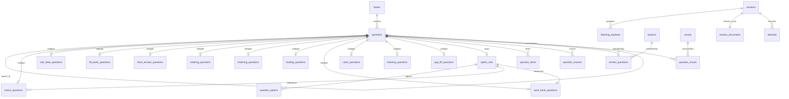

# Question types, relational tables, and JSON contracts

The contract source is [`contracts.py`](../server/src/practiq_ai/contracts.py), and the table definitions are in [`schema.sql`](../app/src-tauri/src/schema.sql). `app/scripts/export-contracts.py` exports `app/src-tauri/contracts.json` for Rust and `app/src/contracts.generated.ts` for the frontend; `--check` rejects stale generated files. Complete basic and composite examples are in [`sample.json`](../app/fixtures/sample.json) and [`composite.json`](../app/fixtures/composite.json).

The same script generates task-summary and review types, question-kind-to-answer-mode mappings, and composite classifications. Rust metadata is in `app/src-tauri/src/question_metadata.rs`. Add new types to the Python contract and regenerate instead of maintaining three separate classification lists. All required indexes are part of the canonical database schema. Startup and backup restoration validate the same complete structure, accepting only LF/CRLF line-ending differences. Missing columns, tables or indexes and unrecognized definitions are rejected without migration.

## Versions and directories

Only `schemaVersion: 3` JSON is accepted, either as a bare result or the `result` in task output. SQLite uses `user_version=11`. Full backups retain container `version=4` and require `schemaVersion=11`; shared question-bank ZIPs retain version 2.

The desktop starts with an empty database in `v4/` under the system application-data directory. Earlier directories, including `v3/`, are not read, migrated, overwritten or deleted. Old full backups and databases are explicitly rejected; current-format question-bank ZIPs remain importable. Initialization accepts only an empty database. Settings contain no executable-path or remote-storage preferences.

The app service access token stays in macOS Keychain, Windows Credential Manager or Android Keystore-backed private storage; the Web token stays in browser memory. The service URL is stored in the separate versioned `v4/service-settings-v1.sqlite` database; practice data remains on schema 11. Backups include only the URL through an optional versioned manifest field and exclude credentials and AI task state. Existing provider settings and keys are preserved, including after saving or clearing a service URL, and are not automatically used as service credentials. Older schema-11 backups remain supported; only their exact existing service marker identifies a service URL. A pending restore record resolves the URL with the published practice database before any offline writes after restart. If publication or durable rollback cannot finish, the current app instance blocks database operations until restart recovery. A killed first settings initialization may leave an empty SQLite file; reads leave it untouched and an explicit save may initialize it.

Python execution state uses version 7, with code, runtime and semantic settings included in its signature. A mismatched signature prevents resume; use the original deployment or reparse the source. Unsupported source formats and graph identifiers return `TASK_FORMAT_UNSUPPORTED`, and are excluded from task lists and scheduling without rewriting their records.

## Entity relationships

```mermaid
erDiagram
  banks ||--o{ questions : contains
  questions o|--o{ questions : parent_id
  questions ||--o| choice_questions : subtype
  questions ||--o| true_false_questions : subtype
  questions ||--o| fill_blank_questions : subtype
  questions ||--o| short_answer_questions : subtype
  questions ||--o| ordering_questions : subtype
  questions ||--o| matching_questions : subtype
  questions ||--o| reading_questions : subtype
  questions ||--o| word_bank_questions : subtype
  questions ||--o| cloze_questions : subtype
  questions ||--o| listening_questions : subtype
  questions ||--o| gap_fill_questions : subtype
  sessions ||--o{ listening_playback : playback
  questions ||--o| option_sets : owns
  option_sets ||--o{ question_options : options
  option_sets ||--o{ choice_questions : references
  option_sets ||--o| word_bank_questions : references
  questions ||--o{ question_items : items
  questions ||--o{ question_sources : source
  sections ||--o{ section_questions : membership
  questions ||--o{ section_questions : membership
  visuals ||--o{ question_visuals : associations
  questions ||--o{ question_visuals : associations
  sessions ||--|| session_documents : freezes_once
  sessions ||--o{ attempts : answers
```

`questions` stores only common fields, with no `snapshot`. Every known answer mode must have exactly one matching subtype record. Unclassified questions retain source text and review state and are not automatically scored. Foreign keys enforce parent/child, option-bank, and material relationships; Rust's shared write boundary validates consistency between groups and subtype tables.

## Table fields

| Table | Fields and meaning |
|---|---|
| `questions` | Primary key `id`; `bank_id`, `import_id`; nullable parent `parent_id`; source order `position`; `stem`, `mode`, `question_type`, `question_kind`, `instructions`; `analysis`, `source_text`; source evidence `source_score`, `scoring_rubric`, `score_source_text`; structured `content_blocks`; `confidence`, `needs_review`, `missing_fields`; `favorite` |
| `choice_questions` | Primary/foreign key `question_id`; single/multiple `variant`; `option_set_id`; validated JSON array or JSON null `correct` |
| `true_false_questions` | `question_id`; JSON boolean or null `value` |
| `fill_blank_questions` | `question_id`; source blank count `blank_count`; ordered JSON array or null `answers` |
| `short_answer_questions` | `question_id`; JSON text or null `answer`; translation/writing languages, genre, and word-count bounds |
| `ordering_questions` | `question_id`; item-ID array or null `answer_order` |
| `matching_questions` | `question_id`; one_to_one/many_to_one `variant`; array of left/right ID pairs or null `matches` |
| `reading_questions` | `question_id`; passage content blocks in `passage` |
| `word_bank_questions` | `question_id`; `passage` with explicit blank references; `allow_reuse`; shared option bank `option_set_id` |
| `cloze_questions` | `question_id`; `passage` with explicit blank references |
| `listening_questions` | `question_id`; `passage`; `audio_ref`; start/end seconds, transcript, and exam play count |
| `gap_fill_questions` | `question_id`; `passage` with explicit blank IDs; one single-blank fill-in child per blank |
| `listening_playback` | `session_id,question_id`; used plays, progress, whether a play is unfinished, current playback start time, and accumulated playback milliseconds; pause/restart does not deduct another play |
| `option_sets` | `id` references the owning question; each option bank is stored once |
| `question_options` | Composite key `owner_id,position`; `label`, `content`; labels are unique within an option bank |
| `question_items` | Composite key `question_id,position`; `item_id`, `label`, `side`, `content`; used for ordering and matching |
| `sections` / `section_questions` | Section `id,bank_id,title,instructions`; membership `section_id,question_id`. Sections are not composite questions that must be answered as a unit |
| `visuals` / `question_visuals` | Material `id,bank_id,content,document_level`; association `visual_id,question_id`. `document_level` explicitly marks document-level material needing confirmation. Mixed-bank snapshots and copies convert material's source-bank scope into explicit question IDs; single-bank snapshots and ZIP exports retain unassociated document-level status. Asset collection removes orphaned question-specific material while retaining document-level material and bytes referenced by current questions or immutable history |
| `assets` | `hash,media,size,path`; image and audio bytes live in immutable `assets/<sha256>` files |
| `question_sources` | `question_id,stage,unit_index`; one question may reference multiple source pages/chunks |
| `question_reviews` | Local `question_id,reviewed_at` confirmation, exposed as nullable `reviewedAt` on desktop rows; separate from imported quality flags |
| `imports` / `import_warnings` | Import `id,bank_id,digest,created_at`, without a duplicate question JSON copy; warnings `import_id,position,message` |
| `session_documents` | `session_id,content`; versioned immutable JSON for the entire session, freezing each parent material and shared option bank once |
| `attempts` | `session_id,ordinal`; weak source-question reference `question_id`; frozen child ID `snapshot_question_id`; `answer`, grading, timing, points, and grading records. Deleting a source question does not affect snapshots |

## JSON examples

Use the [question JSON and rendering reference](question-types-data-rendering.md#2-common-json-structure-and-constraints) for field limits, basic/composite examples, missing answers and type-specific mappings. Complete import examples are [sample.json](../app/fixtures/sample.json), [composite.json](../app/fixtures/composite.json) and [english.json](../app/fixtures/english.json).

Rust assigns bank-local IDs and remaps parent/child, material, section, blank and option references together. Imported group, visual and processing references are remapped with the question IDs. Parser fragments use local indexes; the shared merge stage assigns final result IDs before export. Missing supplied content remains null with review flags.

## Node responsibilities and boundaries

1. Python format readers extract text/pages. Shared text chunking and visual parsing use the same `ParsedQuestion` contract, without separate graphs for question types.
2. Merge handles overlap by source position and reconciles parent/child, material, blank, and source references. Cross-page composite material uses explicit original-source anchors. Uncertain associations retain source content and review flags; failed pages remain document-level material.
3. JSON is exported after validation. Task counts include answerable children, not composite parents again. Existing execution controls still own budgets, retries, usage, and recovery; parsing does not solve questions.
4. Rust `contract.rs` validates the exported schema and references. `questions.rs` is the single relational mapping used by import, complete-group editing, copy-merge, and queries. Images are written and verified before database references are committed.
5. Rust `paper.rs` selects questions, applies quotas and scores, and computes preview digests. `exams.rs` checks the digest at session start, freezes the full session, and scores answers. The frontend handles display and input, without a second set of final selection/scoring rules.
6. Short-answer AI grading requires an explicit action and obtains passages, required materials, and source evidence from structured `materials` in frozen snapshots. Before submission, Rust hides reference answers, explanations, grading evidence, and source-page references that could reveal answers.

## Paper generation and history

An explicit review confirmation applies to a root question and its complete descendant tree. It records local `reviewedAt` without clearing `needsReview`, `missingFields`, confidence or source evidence. The pending-review filter excludes confirmed trees, but confirmation does not guarantee correct answers or allow incomplete evidence to be automatically graded. Editing the tree clears its confirmation. Full study backups preserve it; shared bank ZIPs, copied/merged banks and immutable practice snapshots exclude it. See the [review-fix tracking](review-fixes-20260928.md) for regression and acceptance boundaries.

Question lists refresh through the same guarded query after favorite, delete, save and review actions. Search and question-type filters remain interactive during these actions. The reload uses the current filters and page; a response superseded by a newer query cannot replace its questions, total or page offset. A changed filter resets the page, and a current response can still clamp the offset after deleting the last question on a page.

Total-count selection treats root questions or complete groups as candidates, using subset dynamic programming over leaf counts with a maximum of 1000. If the exact count cannot be met, it requests an adjustment instead of splitting groups. Quotas apply to root types, such as five single-choice questions and two reading groups; previews report actual leaf counts. Randomization changes only root-group order, preserving source order within groups. Mistake, bookmark, and unanswered filters include the whole group when a child matches.

Default scores use hundredths of a point. Remainders after equal division are distributed in child order; parents have no score. Each session writes one `session_documents` record, and answers reference its leaf IDs. Source edits/deletions, bank merges, and backup restore do not rewrite historical content. Restore rejects malformed snapshot containers, rows and nested question objects before expanding their references; a rejected backup leaves the current database and service settings usable in the same app instance.

## Verification

- `app/fixtures/contracts.json`: valid and invalid contract cases shared by Python and Rust.
- `server/tests/test_composite_questions.py`: shared Python workflows, desktop composite samples, and explicit cross-page references.
- `app/src-tauri/src/tests.rs`: real temporary SQLite tests for import, reconstruction, whole-group selection, option-bank constraints, stale digests, immutable history, and backup/restore.
- `make verify`, `make app-check`, and `make app-build`: offline checks and macOS builds. Passing model fakes does not establish live-model recognition quality for new types; measure that separately.

## English question types

`questionKind` is a nullable standard classification: listening, reading, word_bank, cloze, grammar_fill, sentence_selection, paragraph_matching, translation, or writing. `questionTypeId` preserves the source label; `answerMode` determines response structure. Incompatible kind/mode combinations are rejected. Filters and quotas use the standard kind, falling back to the existing answer mode when absent.

- Listening uses a `listening` parent with choice, fill_blank, or short_answer children. Parents can be recognized from instructions, an audio reference, or a transcript alone; missing stems still require review. Missing audio permits import but adds a media review flag. If a reference exists but its resource was not retrieved, the Web result preview lists missing audio and the imported bank retains the missing-resource flag. `audioRef` contains objectKey, sha256, mediaType, and sizeBytes. `audioStartSeconds` defaults to 0; `audioEndSeconds` is nullable. `transcript` preserves source listening text. `examPlayCount` defaults to 2 and accepts 1–100. Segment times are rechecked after merging; ZIP import checks segments against actual audio duration. Transcript content blocks must contain content and cannot bind to question IDs. Audio comes from the local picker, bank ZIP, or an explicit URL import in the question editor; parsing does not fetch external audio or generate transcriptions.
- Grammar fill uses a `gap_fill` parent with `questionKind=grammar_fill`. Each blank maps to a `fill_blank` child with `blankCount=1`. Prompt words remain in child stems.
- Sentence selection uses `word_bank` mode with `sentence_selection`; complete-sentence options are shared once, without fixed blank/option counts. Paragraph matching uses `matching` with `paragraph_matching`, preserving the source's one-to-one or many-to-one rule.
- Translation and writing reuse `short_answer`. `sourceLanguage`/`targetLanguage` use language tags such as zh-CN and en; `writingGenre` preserves the source genre; absent `minWords`/`maxWords` remain null. Source text, supplied material, and continuation starters use `contentBlocks` with roles `source_text`, `material`, and `starter_text`. Reference translations and model essays belong only in `answerPayload.text`.
- `instructions` stores response instructions. `ContentBlock.label` and `ParsedItem.label` preserve printed paragraph/item labels, not internal IDs. Unspecified answers, rubrics, languages, and word limits are not invented.

Practice material appears in a source-material dialog. Blanks retain `questionId` to locate children and show current drafts. English word counts treat contractions and hyphenated words as one word and provide range hints without automatic penalties. Translation/writing practice uses self-assessment; exams allow explicit AI grading only after submission.

Listening practice allows seeking, speed changes, and replay. Exams disallow seeking and speed changes but allow pause. Plays are counted when playback actually starts. Switching children within a group retains the player; leaving the group pauses it. Progress is periodically persisted to SQLite and saved again on pause/exit. Resuming after a normal exit does not consume another play; forced termination may lose approximately the last second of unsaved progress. Transcripts become available after submitting/skipping the whole group or ending practice; exams require submission. Explicitly labeled answers and subsequent content in stems/instructions are hidden from Rust session responses before submission.

Audio is probed and decoded with Symphonia on all app platforms, with bounded input size and duration. Validation checks a five-second deadline between packet operations, but an in-progress Symphonia operation is synchronous and is not interruptible. Playback uses the system WebView on macOS, Windows and Android; device codecs require separate verification. Newly selected audio is staged in the editing session; saving a group writes the file before its database reference. Canceling or switching away from listening releases only that import’s lease; concurrent imports of identical audio retain their own leases. The editor cannot save while an import is pending. Saving a new audio reference requires staged or durable bytes; an unchanged missing reference from an incomplete import remains editable. Saving or deleting questions collects unreferenced audio, checking both current banks and historical snapshots so deleting a source question cannot remove audio still used by history.

Offline sample: [nine English question kinds](../app/fixtures/english.zip). Its three tones verify the player and group workflow; they are not spoken material, evidence of live-model recognition accuracy, or a complete exam bank.

### Listening URLs and QR codes

In the listening question editor, paste an HTTP/HTTPS URL and choose **Fetch audio from URL**, or choose **Read QR image**. Existing question images are also available under **Read QR codes in question images**. QR decoding runs locally and displays discovered URLs; it never opens a site automatically. Select a URL and explicitly fetch it. Pages containing multiple audio resources show a choice of URLs before downloading.

The importer accepts direct MP3, M4A/AAC and WAV resources, plus static HTML audio/source elements, Open Graph audio metadata and links ending in those audio extensions. Relative URLs, HTML entities and up to five redirects are supported. Pages that require login, JavaScript, playlists/streaming or access-controlled players are not extracted; download an authorized audio file separately and use the local picker.

Only public HTTP/HTTPS addresses on ports 80/443 are accepted. Credentials in URLs and private/reserved destinations are rejected, including after redirects. DNS answers are validated and pinned for each request; system proxies are not used. Requests share a 45-second HTTP budget (OS DNS lookup timing is platform-dependent). Audio is capped at 25 MiB, HTML at 2 MiB, and lists at 50 URLs. QR images accept PNG/JPEG only and are capped at 25 MiB and 4096 pixels per side. Question-bank images and grading images also accept only PNG/JPEG; WebP/GIF assets are no longer accepted. Existing files are not deleted.

Downloaded bytes pass the same audio decoder and staging limits as local files. Saving writes immutable local audio before committing its reference; canceling releases the staged bytes. The URL is not stored as a live playback dependency or credential. Playback, bank export and backup continue to use local audio, without a schema change or model call.
