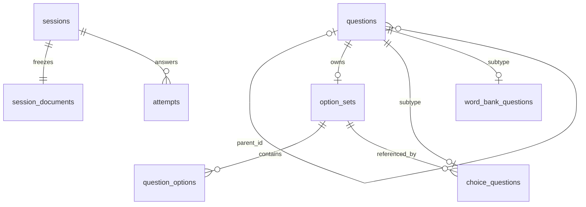
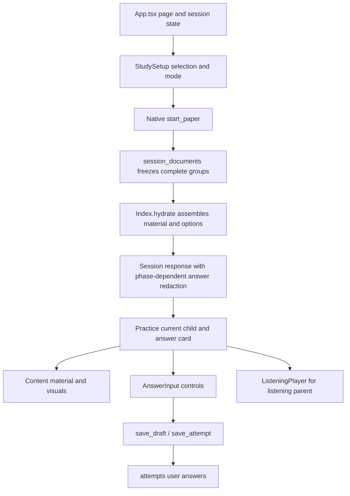

# Question types, JSON data, and frontend rendering

This reference describes the local implementation checked on 2026-09-27, against baseline commit `1cf4152`. Import JSON uses `schemaVersion: 3`; the desktop SQLite database uses `user_version=10`. Supported types have data, validation, and answering paths. This does not establish that AI extraction identifies every such question accurately in arbitrary source documents.

The primary sources are `ParsedQuestion`, `QUESTION_KIND_MODES`, and `validate_question_tree` in [contracts.py](../server/src/practiq_ai/contracts.py), the corresponding native checks in [contract.rs](../app/src-tauri/src/contract.rs), and [schema.sql](../app/src-tauri/src/schema.sql). See [question-model.md](question-model.md) for the broader model and [question-bank-package.md](question-bank-package.md) for ZIP packaging.

## 1. Supported question types

### 1.1 Three distinct classification fields

| Field | Meaning | Implementation role |
| --- | --- | --- |
| `answerMode` | Answering mode; the enum also includes composite material containers | Selects the answer shape, subtype table, input control, grading behavior, and whether the node receives an attempt |
| `questionKind` | Optional semantic classification, including English-specific types | Selects classification labels and specialized material, audio, language, or word-count behavior; must match its prescribed mode |
| `questionTypeId` | Optional source type identifier, up to 128 characters; not an enum | Preserves extraction metadata; missing values trigger review, but this field does not select the input control |

Single and multiple choice both use `answerMode="choice"`, distinguished by `choiceVariant`. Translation and writing both use `short_answer`, distinguished by `questionKind`. Grammar fill uses `questionKind="grammar_fill"` with `answerMode="gap_fill"`. `grammar_fill` is not an answer mode, and `single` is not a question kind.

`questionKind` may be omitted or null. When supplied, it must match the mode; validation does not silently rewrite `answerMode`. Basic choices and true/false questions normally leave the kind unset. `answerMode=null` preserves an unclassified question for free-text answering and review; it is not a twelfth mode and must not imply an automatically incorrect answer.

Sources: `AnswerMode` and `ParsedQuestion.validate_answer` in [contracts.py](../server/src/practiq_ai/contracts.py), `modeNames` and `canInteract` in [api.ts](../app/src/api.ts), and `questionKinds` in [english.ts](../app/src/english.ts).

### 1.2 Basic types: six modes

| Type | `answerMode` | Distinguishing fields | Reference `answerPayload` shape | Automatic comparison |
| --- | --- | --- | --- | --- |
| Single choice | `choice` | `choiceVariant="single"` | `{"correct":["A"]}` | Equal option-label sets |
| Multiple choice | `choice` | `choiceVariant="multiple"` | `{"correct":["A","C"]}` | Exactly equal label sets; no partial credit |
| True/false | `true_false` | None | `{"value":false}` | Equal booleans; false is a valid answer |
| Fill in the blank | `fill_blank` | `blankCount` | `{"answers":["first","second"]}` | Ordered comparison after trimming outer whitespace; case-sensitive |
| Short answer | `short_answer` | May be classified as translation or writing | `{"text":"Source reference answer"}` | No exact-string automatic grading; self-evaluation or explicitly requested grading |
| Ordering | `ordering` | `items` | `{"order":[1,0]}` | Exact item-ID order |
| Matching | `matching` | `matchingVariant="one_to_one"` or `"many_to_one"` | `{"matches":[{"left":0,"right":2}]}` | Equal pair collections, independent of pair-array order |

Automatic grading also requires a complete reference answer and usable structure/resources. Missing answers or required material remain ungraded rather than automatically incorrect. `needsReview=true` alone does not necessarily disable interaction or grading. See `answer_complete` and `grade` in [contract.rs](../app/src-tauri/src/contract.rs), and resource/self-evaluation checks in `write_attempt` in [sessions.rs](../app/src-tauri/src/sessions.rs).

### 1.3 Composite types: five parent modes

Composite parents hold material and relationships. Their `answerPayload` must be null; only non-composite descendants receive attempts and contribute to question counts and scores.

| Parent mode | Material and purpose | Direct-child constraints |
| --- | --- | --- |
| `reading` | Reading passage in `passage` | Basic questions or composite `word_bank`, `cloze`, and `gap_fill` nodes; cannot contain another `reading` or `listening` node |
| `word_bank` | Shared `options`, passage blanks, and `allowReuse`; used for words or sentences | Single-choice children only; `optionSourceId` must equal the parent ID, with no local child options |
| `cloze` | Passage with explicit blanks | Single-choice children only; each child owns its options |
| `listening` | Audio and listening material; `passage` may be empty | `choice`, `fill_blank`, or `short_answer`; choices may be single or multiple |
| `gap_fill` | Passage completed through text input, including grammar fill | `fill_blank` children only, each with `blankCount=1` |

For `word_bank`, `cloze`, and `gap_fill`, passage blocks with `partType="blank"` must reference every direct child exactly once through `questionId`. Duplicate, missing, and foreign references are rejected. Passage blank order and node-array order are separate information; printed question numbers are not references.

A non-listening parent without a passage, or any composite parent without children, is marked with missing `material`. Invalid ancestry, cycles, incompatible child modes, and inconsistent blank references fail validation. `reading` and `listening` cannot themselves be children of another question. Sources: `COMPOSITE_MODES` and `validate_question_tree` in [contracts.py](../server/src/practiq_ai/contracts.py), and `validate_tree` in [contract.rs](../app/src-tauri/src/contract.rs).

### 1.4 All nine semantic kinds

| `questionKind` | Meaning / Chinese UI label | Required `answerMode` | Specialized behavior |
| --- | --- | --- | --- |
| `listening` | Listening / “听力题” | `listening` | Audio reference, segment, transcript, exam play limit |
| `reading` | Reading comprehension / “阅读理解” | `reading` | Passage and child navigation |
| `word_bank` | Word bank / “选词填空” | `word_bank` | Shared options, no reuse by default |
| `cloze` | Cloze / “完形填空” | `cloze` | Passage blanks navigate to individual choices |
| `grammar_fill` | Grammar fill / “语法填空” | `gap_fill` | A separate single-blank input child for each blank |
| `sentence_selection` | Sentence selection / “七选五” | `word_bank` | Sentences as shared options; the contract does not require exactly seven options or five blanks |
| `paragraph_matching` | Paragraph matching / “段落匹配” | `matching` | Full right-side paragraphs in the material panel; labels or positional numbers in selectors |
| `translation` | Translation / “翻译题” | `short_answer` | Source/target languages; source material in `contentBlocks` |
| `writing` | Writing / “写作题” | `short_answer` | Target language, genre, minimum/maximum words, live word count |

`QUESTION_KIND_MODES` in [contracts.py](../server/src/practiq_ai/contracts.py) is exported by [export-contracts.py](../app/scripts/export-contracts.py) into [contracts.generated.ts](../app/src/contracts.generated.ts) and [question_metadata.rs](../app/src-tauri/src/question_metadata.rs). Extend the source mapping and regenerate rather than maintaining independent lists.

## 2. Common JSON structure and constraints

### 2.1 Document envelope

The importer accepts a bare `DocumentParseResult` or the `result` inside task output. This standalone single-choice example validates against the current contract. Its reference answer is supplied by the example author; parsing does not solve questions.

```json
{
  "schemaVersion": 3,
  "questions": [
    {
      "id": "choice-1",
      "parentId": null,
      "answerMode": "choice",
      "questionKind": null,
      "questionTypeId": "single_choice",
      "stem": "Choose the greeting.",
      "instructions": "Choose one answer.",
      "choiceVariant": "single",
      "options": [
        {"label": "A", "content": "Hello"},
        {"label": "B", "content": "Goodbye"}
      ],
      "answerPayload": {"correct": ["A"]},
      "analysis": "The source identifies A as the greeting.",
      "sourceScore": 2.0,
      "scoringRubric": null,
      "scoreSourceText": "Each question is worth 2 points.",
      "contentBlocks": [],
      "sourceText": "Choose the greeting. A. Hello B. Goodbye Answer: A",
      "confidence": 1.0,
      "needsReview": false,
      "missingFields": []
    }
  ],
  "groups": [],
  "visualElements": [],
  "warnings": [],
  "confidenceScore": 100
}
```

Required envelope fields are `schemaVersion` (exactly 3), `questions` (1–1000 nodes including parents), `groups`, `visualElements`, `warnings` (each at most 1000 entries), and `confidenceScore` (0–100). Document confidence differs from a question's 0–1 `confidence`. Strict models forbid extra fields; `extra="forbid"` does not mean every Pydantic field forbids coercion. Strict booleans and integers follow their individual declarations.

### 2.2 Common fields and the `questions` table

Nullable fields generally also permit omission, using contract defaults. Fragment-level `ParsedQuestion.id` may be null, but every final document node needs a nonempty unique ID. String limits count characters.

| JSON field | Type, default, and constraint | SQLite `questions` column |
| --- | --- | --- |
| `id` | string, 1–128; required and unique in final documents | `id TEXT PRIMARY KEY`; reassigned on import |
| `parentId` | string / null, 1–128; valid composite parent reference | `parent_id TEXT`, self-referencing FK with cascading child deletion |
| `answerMode` | One of 11 modes / null | `mode TEXT` |
| `questionKind` | One of 9 kinds / null; must match mode | `question_kind TEXT` |
| `questionTypeId` | string / null, maximum 128 | `question_type TEXT` |
| `stem` | string / null, maximum 120000 | `stem TEXT` |
| `instructions` | string / null, maximum 20000 | `instructions TEXT` |
| `analysis` | string / null, maximum 100000; source-provided explanation | `analysis TEXT` |
| `sourceText` | string / null, maximum 120000; literal source text, not a summary | `source_text TEXT` |
| `sourceScore` | finite number / null, `0 < x <= 1000000`, increment 0.01; numeric strings rejected | `source_score REAL` |
| `scoringRubric` | string / null, maximum 100000; source scoring rules | `scoring_rubric TEXT` |
| `scoreSourceText` | string / null, maximum 100000; score/rubric evidence | `score_source_text TEXT` |
| `contentBlocks` | `ContentBlock[]`, default empty, maximum 1000; no answerable blanks | `content_blocks TEXT NOT NULL`, JSON array |
| `confidence` | number, default 0, range 0–1; extraction reliability | `confidence REAL NOT NULL`, SQL range check |
| `needsReview` | boolean, default true; missing fields force true | `needs_review INTEGER NOT NULL`, 0/1 only |
| `missingFields` | Enum array, default empty; recomputed by validation | `missing_fields TEXT NOT NULL`, JSON array |

`bank_id`, `import_id`, `position`, and `favorite` are desktop metadata, not imported `ParsedQuestion` fields. `position` follows node order; `favorite` is 0/1 and defaults to 0. `banks` holds bank metadata; `imports` holds batch IDs, digests, and timestamps.

`answerPayload` is split into subtype tables rather than stored in the common row. Passage, audio, options, items, and translation/writing metadata have the mappings below. There is no `questions.snapshot` column.

Sources: `ParsedQuestion` in [contracts.py](../server/src/practiq_ai/contracts.py), `write` and `read_scoped` in [questions.rs](../app/src-tauri/src/questions.rs), and [schema.sql](../app/src-tauri/src/schema.sql). Python/Rust enforce JSON ranges and cross-field consistency. SQL `json_valid` alone does not enforce the complete contract.

### 2.3 Missing data, reference answers, and drafts

Specified text fields, including stem, type identifier, mode, variants, explanation, and source text, are trimmed and blank strings become null. Explicit null for `options`, `items`, `contentBlocks`, and `missingFields` becomes an empty array in Python. Use arrays or omission for `passage` and `transcript`; not every list field accepts explicit null.

Complete answer arrays contain 1–100 entries. Incomplete extraction can retain `answerPayload=null`, null array elements, empty arrays, and incomplete matching pairs. For example, `{"answers":["known",null]}` preserves the second blank and triggers review; it must not be shortened to one answer. Blank answer strings also become null. Complete-answer model constraints must not erase intentionally preserved partial data.

`missingFields` permits `stem`, `questionTypeId`, `answerMode`, `choiceVariant`, `matchingVariant`, `options`, `items`, `answerPayload`, `analysis`, `sourceText`, `media`, and `material`. Repairable omissions usually preserve a reviewable question. Wrong types, contradictory references, and out-of-range values are rejected. A completely empty object is not an identifiable question.

Reference answers and user drafts are separate: `question.answerPayload` holds the source reference; `AnswerInput` emits an `Answer` saved to `attempts.answer`. Free-text fallback emits `{"text":"..."}`. Drafts can be incomplete; `answerReady` controls the practice submission button, while native `validate_attempt` validates writes. Each reference fill answer is one string, with no nested array of equivalent alternatives for a single blank.

Sources: `normalize_answer` and `question_missing_fields` in [contracts.py](../server/src/practiq_ai/contracts.py), `validate_attempt` in [contract.rs](../app/src-tauri/src/contract.rs), and `answerReady` in [api.ts](../app/src/api.ts).

## 3. Type-specific JSON and database mappings

### 3.1 Basic modes

Every subtype table uses `question_id` as a primary key and FK to `questions.id`. The shared writer creates the matching subtype for each classified question. Answer-bearing `TEXT NOT NULL` columns store JSON text: missing answers use JSON `null`, not SQL NULL.

| Mode | Type-specific JSON | Storage |
| --- | --- | --- |
| `choice` | `choiceVariant`, local `options` or `optionSourceId`, `answerPayload.correct` | `choice_questions.variant,option_set_id,correct`; option content in `option_sets` / `question_options` |
| `true_false` | `answerPayload.value`, strict boolean | `true_false_questions.value`, JSON true / false / null |
| `fill_blank` | `blankCount`, integer 1–100 / null; ordered `answerPayload.answers` | `fill_blank_questions.blank_count,answers` |
| `short_answer` | Nonempty `answerPayload.text`, maximum 120000; optional language/writing metadata | `short_answer_questions.answer`, JSON string / null |
| `ordering` | `items`; integer-ID array `answerPayload.order` | `question_items`; `ordering_questions.answer_order` |
| `matching` | `matchingVariant`; sided `items`; integer `{left,right}` pairs in `answerPayload.matches` | `question_items`; `matching_questions.variant,matches` |

`options` contains at most 100 `{label,content}` objects. Labels allow up to 32 characters and content up to 20000; both may be null to preserve omissions. Interactive choices require at least two options with complete labels/content. Labels are unique case-insensitively; answer labels must reference supplied options without duplicates. A complete single-choice answer contains exactly one label.

Local option owners create `option_sets.id=question ID`. `question_options` has primary key `(owner_id,position)`, fields `label,content`, and uniqueness on `(owner_id,label)`. Ordinary choices reference their own option set; shared choices reference their parent's set. Exported shared children retain `options=[]` and `optionSourceId`.

`items` contains at most 100 objects with `id: integer|null`, `label: string|null` (maximum 64), `side: "left"|"right"|null`, and `content: string|null` (maximum 20000). These map to `question_items.item_id,label,side,content`; array order maps to `position`. Ordering items must have no side; matching items identify a side.

Interactive ordering requires at least two complete items. Matching requires at least two complete items per side, with effective IDs unique within their scope. Missing IDs fall back to zero-based array positions for ordering and zero-based positions after filtering each side for matching. Explicit IDs avoid reference changes when items move. Ordering answers cannot repeat or reference unknown items and must cover every item to be complete. Matching uses each left item once; `one_to_one` also requires distinct right items, while `many_to_one` allows reuse. Complete fill answers infer `blankCount`; an explicit count must match their length.

The following node array can replace envelope `questions`. Omitted common fields use defaults; omissions such as source text or explanation intentionally produce review flags.

```json
[
  {
    "id": "multiple-1", "stem": "Select the vowels.",
    "answerMode": "choice", "choiceVariant": "multiple",
    "options": [{"label":"A","content":"a"},{"label":"B","content":"b"},{"label":"C","content":"e"}],
    "answerPayload": {"correct":["A","C"]}
  },
  {
    "id": "true-false-1", "stem": "The source statement is false.",
    "answerMode": "true_false", "answerPayload": {"value":false}
  },
  {
    "id": "fill-1", "stem": "Complete the two blanks.",
    "answerMode": "fill_blank", "blankCount": 2,
    "answerPayload": {"answers":["is",null]}
  },
  {
    "id": "short-1", "stem": "Explain the source's main idea.",
    "answerMode": "short_answer",
    "answerPayload": {"text":"The supplied reference explanation."}
  },
  {
    "id": "ordering-1", "stem": "Put the steps in order.",
    "answerMode": "ordering",
    "items": [{"id":0,"content":"Finish"},{"id":1,"content":"Start"}],
    "answerPayload": {"order":[1,0]}
  },
  {
    "id": "matching-1", "stem": "Match the words.",
    "answerMode": "matching", "matchingVariant": "one_to_one",
    "items": [
      {"id":0,"side":"left","content":"cat"},{"id":1,"side":"left","content":"dog"},
      {"id":2,"side":"right","content":"猫"},{"id":3,"side":"right","content":"狗"}
    ],
    "answerPayload": {"matches":[{"left":0,"right":2},{"left":1,"right":3}]}
  }
]
```

Sources: answer models, `ParsedOption`, and `ParsedItem` in [contracts.py](../server/src/practiq_ai/contracts.py); [schema.sql](../app/src-tauri/src/schema.sql); `write` in [questions.rs](../app/src-tauri/src/questions.rs); `itemIds` and `canInteract` in [api.ts](../app/src/api.ts).

### 3.2 Composite modes and shared options

| Mode | Parent fields | Subtype columns |
| --- | --- | --- |
| `reading` | `passage: ContentBlock[]` | `reading_questions.passage`, JSON text |
| `word_bank` | `passage`, `options`, `allowReuse: boolean` (default false) | `word_bank_questions.passage,allow_reuse,option_set_id`; parent owns options |
| `cloze` | `passage` | `cloze_questions.passage` |
| `listening` | `passage` and audio fields below | `listening_questions` |
| `gap_fill` | `passage` | `gap_fill_questions.passage` |

Passages contain at most 1000 blocks. Non-composite modes cannot carry a nonempty passage. Only `word_bank` allows `allowReuse=true`. `optionSourceId` is a nullable 1–128-character string: in a valid tree, only a single-choice child can reference its own word-bank parent, and local options must be empty. When reuse is false, reference answers and saved sibling drafts cannot select the same option.

Reading example: the parent stores the passage once and the child references it through `parentId`.

```json
[
  {"id":"reading-1","answerMode":"reading","questionKind":"reading","stem":"Read the passage.","passage":[{"partType":"text","textValue":"Mia walks to school."}],"answerPayload":null},
  {"id":"reading-1-a","parentId":"reading-1","answerMode":"choice","choiceVariant":"single","stem":"How does Mia go to school?","options":[{"label":"A","content":"On foot"},{"label":"B","content":"By bus"}],"answerPayload":{"correct":["A"]}}
]
```

Shared-option example: this uses `sentence_selection`; changing the parent's kind to `word_bank` expresses word-bank fill using the same structure. One blank and two choices demonstrate that the contract does not enforce the numbers implied by the Chinese seven-choose-five label.

```json
[
  {
    "id":"sentences-1","answerMode":"word_bank","questionKind":"sentence_selection",
    "stem":"Choose the sentence.","allowReuse":false,
    "options":[{"label":"A","content":"It was raining."},{"label":"B","content":"It was sunny."}],
    "passage":[{"partType":"text","textValue":"Mia opened her umbrella."},{"partType":"blank","questionId":"sentences-1-a"}],
    "answerPayload":null
  },
  {
    "id":"sentences-1-a","parentId":"sentences-1","answerMode":"choice","choiceVariant":"single",
    "stem":"Blank 1","optionSourceId":"sentences-1","options":[],"answerPayload":{"correct":["A"]}
  }
]
```

Cloze example: each child owns its choices; the parent has no shared option set.

```json
[
  {"id":"cloze-1","answerMode":"cloze","questionKind":"cloze","stem":"Complete the passage.","passage":[{"partType":"text","textValue":"She"},{"partType":"blank","questionId":"cloze-1-a"},{"partType":"text","textValue":"to school every day."}],"answerPayload":null},
  {"id":"cloze-1-a","parentId":"cloze-1","answerMode":"choice","choiceVariant":"single","stem":"Blank 1","options":[{"label":"A","content":"walks"},{"label":"B","content":"walk"}],"answerPayload":{"correct":["A"]}}
]
```

Grammar-fill example: each passage blank references a single-blank text-input child.

```json
[
  {"id":"grammar-1","answerMode":"gap_fill","questionKind":"grammar_fill","stem":"Fill in the correct form.","passage":[{"partType":"text","textValue":"She"},{"partType":"blank","questionId":"grammar-1-a"},{"partType":"text","textValue":"(walk) to school every day."}],"answerPayload":null},
  {"id":"grammar-1-a","parentId":"grammar-1","answerMode":"fill_blank","blankCount":1,"stem":"Blank 1: walk","answerPayload":{"answers":["walks"]}}
]
```



See [composite.json](../app/fixtures/composite.json) for complete examples, `validate_tree` in [contract.rs](../app/src-tauri/src/contract.rs) for relationships, and `write_attempt` in [sessions.rs](../app/src-tauri/src/sessions.rs) for reuse checks on saved drafts.

### 3.3 Listening

| JSON field | Type and constraint | `listening_questions` column |
| --- | --- | --- |
| `audioRef` | `AudioReference / null`; missing audio preserves the question with missing `media` | `audio_ref TEXT NOT NULL`, JSON object / null |
| `audioStartSeconds` | Finite number, default 0, range 0–86400 | `start_seconds REAL NOT NULL` |
| `audioEndSeconds` | Finite number / null, `0 < x <= 86400` and greater than start; null means file end | `end_seconds REAL` |
| `transcript` | `ContentBlock[]`, default empty, maximum 1000; no blank blocks | `transcript TEXT NOT NULL`, JSON array |
| `examPlayCount` | Strict integer 1–100, default 2 | `play_count INTEGER NOT NULL`, SQL range check |

`AudioReference` contains `objectKey` (relative resource path, 1–1024 characters), `sha256` (64 lowercase hexadecimal characters), `mediaType` (`audio/mpeg`, `audio/mp4`, `audio/aac`, or `audio/wav`), and `sizeBytes` (positive integer, maximum 25 MiB). Paths reject backslashes, colons, empty segments, `.` and `..`. Import also checks actual bytes, size, hash, and decoded duration; a valid JSON reference does not establish resource availability.

Start must be before actual file duration, and end must not exceed duration plus a 0.05-second tolerance. Non-listening questions cannot carry audio references, nonempty transcripts, or nondefault audio parameters. Current native audio inspection uses macOS `/usr/bin/afinfo`. Playback uses local assets, without automatic transcription, TTS, or remote audio streaming.

This reference comes from [english.json](../app/fixtures/english.json) and requires the actual [chimes.wav](../app/fixtures/resources/audio/chimes.wav) resource in the package. The three-chime fixture tests playback structure, not English speech recognition.

```json
[
  {
    "id":"listening-1","answerMode":"listening","questionKind":"listening",
    "stem":"Listen and answer.","instructions":"Listen to the chimes.",
    "audioRef":{"objectKey":"audio/chimes.wav","sha256":"aae1f486a2b9b8a734eb2100a07e9ce94734406813beec436d2ce7ed332a2bc9","mediaType":"audio/wav","sizeBytes":96044},
    "audioStartSeconds":0,"audioEndSeconds":null,"examPlayCount":2,
    "passage":[],"transcript":[{"partType":"text","textValue":"Three chimes are played."}],
    "answerPayload":null
  },
  {"id":"listening-1-a","parentId":"listening-1","answerMode":"fill_blank","blankCount":1,"stem":"How many chimes?","answerPayload":{"answers":["3"]}}
]
```

Sources: `AudioReference` and `ParsedQuestion` in [contracts.py](../server/src/practiq_ai/contracts.py); `audio_info`, `validate_segment`, and `persist_audio` in [audio.rs](../app/src-tauri/src/audio.rs); resource import in [bank_zip.rs](../app/src-tauri/src/bank_zip.rs).

### 3.4 Paragraph matching, translation, and writing

Paragraph matching has no separate subtype table: it uses `matching_questions` and `question_items`. Right-side items hold full paragraphs and optional labels. Pairs use integer IDs. `many_to_one` allows several statements to reference one paragraph; `one_to_one` forbids that reuse.

Translation and writing share `short_answer`; their extensions are stored in `short_answer_questions`:

| JSON field | Constraint | Column |
| --- | --- | --- |
| `sourceLanguage` | Translation only; string / null, maximum 64; matches `^[A-Za-z]{2,8}(?:-[A-Za-z0-9]{1,8})*$` | `source_language TEXT` |
| `targetLanguage` | Translation or writing only; same format | `target_language TEXT` |
| `writingGenre` | Writing only; string / null, maximum 128 | `writing_genre TEXT` |
| `minWords` | Writing only; strict integer 0–100000 / null | `min_words INTEGER` |
| `maxWords` | Writing only; strict integer 1–100000 / null; if both bounds exist, minimum must not exceed maximum | `max_words INTEGER` |

Language tags receive a format check, not a registry lookup. Word limits produce UI guidance, not submission blocking. Examples:

```json
[
  {
    "id":"paragraph-1","answerMode":"matching","questionKind":"paragraph_matching",
    "stem":"Match the statements to paragraphs.","matchingVariant":"many_to_one",
    "items":[
      {"id":0,"side":"left","content":"The writer mentions school."},
      {"id":1,"side":"left","content":"The writer mentions walking."},
      {"id":2,"side":"right","label":"A","content":"Mia walks to school."},
      {"id":3,"side":"right","label":"B","content":"Mia reads at home."}
    ],
    "answerPayload":{"matches":[{"left":0,"right":2},{"left":1,"right":2}]}
  },
  {
    "id":"translation-1","answerMode":"short_answer","questionKind":"translation",
    "stem":"Translate into English.","sourceLanguage":"zh-CN","targetLanguage":"en",
    "contentBlocks":[{"partType":"text","textValue":"她每天步行去学校。"}],
    "answerPayload":{"text":"She walks to school every day."}
  },
  {
    "id":"writing-1","answerMode":"short_answer","questionKind":"writing",
    "stem":"Write a letter.","targetLanguage":"en","writingGenre":"letter",
    "minWords":80,"maxWords":120,
    "contentBlocks":[{"partType":"text","textValue":"Invite your friend to a school event."}],
    "answerPayload":null,"scoringRubric":"The source rubric awards points for task coverage, organization and language."
  }
]
```

Sources: specialized-field validation in [contracts.py](../server/src/practiq_ai/contracts.py), [AnswerInput.tsx](../app/src/AnswerInput.tsx), [Content.tsx](../app/src/Content.tsx), and [english.ts](../app/src/english.ts).

## 4. Rich content, sections, and associated resources

### 4.1 Content blocks

`contentBlocks`, `passage`, and `transcript` share `ContentBlock`:

| Field | Type and limit |
| --- | --- |
| `partType` | Required enum: `text`, `formula`, `image`, `table`, `list`, `html`, `markdown`, `chart`, `diagram`, `blank`, `qr_code` |
| `label` | string / null, maximum 64 |
| `role` | string / null, maximum 64; distinguishes ordinary material from answer-bearing content |
| `questionId` | string / null, 1–128; required for blanks and forbidden on other blocks |
| `textValue` | string / null, maximum 120000 |
| `markdownValue` | string / null, maximum 100000 |
| `latexValue` | string / null, maximum 20000 |
| `jsonValue` | JSON object / null, not an arbitrary top-level array or scalar |

Nonblank blocks require at least one nonblank string value or non-null `jsonValue`. Blank blocks belong only in passages, not common content or transcripts. Blocks remain JSON in their owning question's common/subtype column; there is no separate content-block table.

### 4.2 Sections, visuals, and sources

| Document/context field | Database mapping | Relationship |
| --- | --- | --- |
| `groups[].title,instructions,questionIds` | `sections(id,bank_id,title,instructions)`; `section_questions(section_id,question_id)` | Sections are not composite parent questions; IDs reference existing nodes |
| `visualElements[]` | `visuals(id,bank_id,content,document_level)`; `question_visuals(visual_id,question_id)` | JSON content with explicit question associations or document-level status |
| Bytes behind `imageRef`, `sourceRef`, and `audioRef` | `assets(hash,media,size,path)` | Content-addressed files under `assets/<sha256>`, not binary data inside question rows |
| Task `processing.questionSources[]` | `question_sources(question_id,stage,unit_index)` | Stage is `document_parse` or `vision_parse`; nonnegative unit index; not a `ParsedQuestion` field |
| `warnings[]` | `import_warnings(import_id,position,message)` | Ordered import-batch warnings |

Final `DocumentGroup` requires a title of 1–1000 characters, optional instructions up to 20000, and at most 1000 question IDs. Fragment `ParsedGroup.questionIndexes` uses zero-based positions in that fragment; final export converts them to IDs. Do not interchange the two.

`DocumentVisual` contains `kind` (`image/table/chart/diagram/qr_code`), required nonblank `description` (maximum 20000), optional `label` (1000), `extractedText` (100000), `role` (64), nonnegative integer `page`, `bbox`, `imageRef`, `sourceRef`, and up to 1000 question IDs. `bbox` has four finite normalized values `[x0,y0,x1,y1]`, each between 0 and 1, with positive width and height.

`imageRef` points to a question image/crop; `sourceRef` points to the complete verification page, which may include answers. Both use `ArtifactReference`: `objectKey` length 1–1024, a 64-character lowercase SHA-256, `mediaType` length 1–255, and nonnegative integer `sizeBytes`. Actual resource acceptance also checks formats, paths, and hashes. Unassociated visuals display a document-level association warning, not an assertion that they belong exclusively to the current question.

Import remaps node IDs, parent IDs, option owners, passage blank IDs, section membership, and visual associations together. Sources: `remap`, `put_context`, and `read_scoped` in [questions.rs](../app/src-tauri/src/questions.rs), and `DocumentGroup`, `VisualContent`, and `DocumentProcessing` in [contracts.py](../server/src/practiq_ai/contracts.py).

## 5. Frontend rendering

### 5.1 Component and data flow



`App.tsx` manages lists, details, editing, and session entry, loading components as needed. Type-specific input dispatch belongs to `AnswerInput.tsx`; material layout belongs to `Content.tsx`. `Practice` selects `session.attempts[session.position]`, labels the question by kind when available or otherwise mode, and adds a single/multiple-choice suffix.

`canInteract` checks input structure first. Unknown modes and incomplete choice/ordering/matching structures fall back to free text with a self-evaluation notice. A usable input structure with no reference answer still allows normal interaction, without forcing a grading result. Sources: [App.tsx](../app/src/App.tsx), [StudySetup.tsx](../app/src/StudySetup.tsx), [Practice.tsx](../app/src/Practice.tsx), and [api.ts](../app/src/api.ts).

### 5.2 Actual input interactions

| Type | Control and interaction | Emitted user answer |
| --- | --- | --- |
| Single choice, including word-bank/sentence/cloze children | `RadioGroup` chooses one label | `{correct:[label]}` |
| Multiple choice | `Checkbox` list toggles labels | `{correct:[...labels]}` |
| True/false | Two radio options | `{value:boolean}` |
| Fill/grammar-fill children | One `Input` per blank; can add a blank when count is unknown | `{answers:[...strings]}` |
| Short answer/translation | Usually seven-row `Textarea`; incomplete-structure fallback uses five rows | `{text:string}` |
| Writing | Fourteen-row `Textarea`, live word count, spellcheck disabled | `{text:string}` |
| Ordering | Move-up/move-down buttons; boundaries disabled; confirm current order | `{order:[...itemIds]}` |
| Matching | One native right-item selector per left item | `{matches:[{left,right},...]}` |
| Paragraph matching | Same selectors, showing right labels or positional numbers; full paragraphs in material panel | Same matching shape |
| Composite parent | Material panel, blank navigation, and child navigation | No parent answer |

There is no drag-and-drop sorting, line-drawing matching, or dragging words into blanks. Ordering and matching persist IDs, not displayed content. Matching selectors do not disable a right item selected elsewhere; native validation rejects conflicting one-to-one writes. Do not describe all conflict prevention as implemented in the frontend.

`countEnglishWords` in [english.ts](../app/src/english.ts) counts Unicode letter/number groups, retaining internal apostrophes and hyphens within a word. Exceeding a word limit only displays a warning and still permits submission; it does not automatically deduct points. See `AnswerInput` and `AnswerDisplay` in [AnswerInput.tsx](../app/src/AnswerInput.tsx).

### 5.3 Parent material, navigation, and shared options

1. Selection operates on roots. `paper.selected_rows` expands complete trees and rejects selecting only an individual composite child. Only non-composite nodes count toward attempts.
2. `questions.Index.hydrate` follows parent IDs, orders material from outer ancestor to direct parent, and merges/deduplicates parent sections and visuals. Missing parent material/audio/options affects the child's resource availability.
3. `Practice` answers one child at a time, shows navigation for siblings with the same `parentId`, and provides a global answer card. The material dialog uses the Chinese label “查看原文”. Selecting a blank closes the dialog and navigates to its child, after saving the current draft.
4. `Blocks` numbers blanks by passage order and shows their current selected/input answers. Blanks are navigation buttons; actual answering happens in `AnswerInput`.
5. Shared options are stored once in the parent and frozen document. `hydrate` fills the child snapshot's options for the ordinary choice control, without a second frontend request. The current material dialog does not render a separate shared-option panel; the options appear in the child's answer area.
6. With `allowReuse=false`, `Practice` collects other drafts using the same option source and passes `usedOptions`. Used choices are labelled and disabled, while the current choice remains selectable. Rust rechecks reuse on write.

[QuestionPreview.tsx](../app/src/QuestionPreview.tsx) paginates by 20 roots, preserves complete groups, resolves shared options, and allows expanding answers/explanations/sources. It serves import/detail review rather than the exam answering flow.

Sources: `selected_rows` in [paper.rs](../app/src-tauri/src/paper.rs), `Index.hydrate` and `freeze` in [questions.rs](../app/src-tauri/src/questions.rs), [Practice.tsx](../app/src/Practice.tsx), [Content.tsx](../app/src/Content.tsx), and [sessions.rs](../app/src-tauri/src/sessions.rs).

### 5.4 Rich-media behavior and limits

`Content.tsx` uses `react-markdown`, GFM, math plugins, and KaTeX. Markdown tables/lists and inline/display formulas render. `Blocks` wraps `latexValue` as display math and renders `markdownValue` plus a distinct `textValue`. `jsonValue` is shown as formatted JSON in a `<pre>`.

A `partType` is not necessarily a specialized renderer. Tables need renderable content such as Markdown; charts, diagrams, and QR codes do not automatically generate charts or scan codes. Raw HTML is skipped, Markdown image URLs become descriptive placeholders, and links display as underlined text rather than opening remote URLs. KaTeX uses `trust:false`.

Actual images are rendered by `ImageAsset`, which reads local bytes with the native `asset` command using `Visual.imageRef.sha256`, creates a Blob URL, and displays a thumbnail and scrollable zoom dialog. URLs are released on cleanup. Complete source pages use a separate “查看原页” control and load on demand only when viewing is permitted. Missing assets display a notice; they are not fetched from the internet.

Native `answer_content` identifies roles containing `answer`, `analysis`, `solution`, `explanation`, `rubric`, `transcript`, and their supported Chinese counterparts. `strip_answer_lines` also handles explicit answer labels in stems/instructions. This is role/text filtering, not answer detection inside unlabelled images. Answer-bearing parent passage blocks are already removed by `hydrate`; do not rely on them reappearing in the same material panel after submission. Use the dedicated reference-answer and explanation fields.

Sources: `Markdown`, `Blocks`, and `ImageAsset` in [Content.tsx](../app/src/Content.tsx); `answer_content` and `hydrate` in [questions.rs](../app/src-tauri/src/questions.rs); `strip_answer_lines` in [exams.rs](../app/src-tauri/src/exams.rs).

### 5.5 Listening playback

`Practice` locates the listening parent in `snapshot.materials` and passes it and the session to `ListeningPlayer`. Its key includes session ID, parent ID, and audio hash, so switching sibling questions does not recreate the player. It reads local audio and uses an `<audio>` element without native controls, with custom controls for the selected segment.

Playback is independent of child answers. `listening_playback` uses `(session_id,question_id)`, where the question ID belongs to the frozen listening parent. `used` counts started plays, `position` stores seconds, `active` means a play remains unfinished, and `updated_at` / `active_elapsed_ms` track actual playback time. Pausing does not clear `active` or charge another play on resume; starting again after completion consumes the next play.

Visibility changes, leaving the page, and unmounting pause/save playback. Exams restrict speed and seeking; the native side checks remaining plays and plausible progress. Historical review uses unrestricted playback without mutating locked session counts. Missing audio, browser start failures, or resource mismatches display errors rather than implying completed listening work.

Sources: [ListeningPlayer.tsx](../app/src/ListeningPlayer.tsx), `listening_playback` in [audio.rs](../app/src-tauri/src/audio.rs), and [schema.sql](../app/src-tauri/src/schema.sql).

## 6. Practice, self-test, and mock exams

Session behavior is selected by `Session.kind` / `sessions.kind`, not question `answerMode` or the separate `sessions.mode` used for ordering.

| Behavior | `practice` | `self_test` | `mock_exam` |
| --- | --- | --- | --- |
| Submission | Submit/skip individual questions; on finish submit drafts or mark them skipped | Submit the entire paper; drafts remain editable beforehand | Entire-paper submission; expiration submits saved drafts |
| Answers/explanations | After current-question submission | After paper submission | After paper submission |
| Reading/source material dialog | Available | Answering material remains available | Answering material remains available |
| Complete source-page image | After current submission; may remain hidden until listening group unlocks | Hidden before paper submission | Hidden before paper submission |
| Listening transcript | After every child in the listening group is submitted, or session finishes | After paper submission | After paper submission |
| Listening controls | Replay, seek, and 0.75/1/1.25/1.5 speed | Before submission: speed 1, no seek, `examPlayCount` limit; pause/resume allowed | Same as self-test |
| Per-question elapsed time | Counts only while unsubmitted, unfinished, visible, and focused | Same | Same, plus an absolute deadline |
| Countdown | None | None | UI default 60 minutes; configurable 1–1440; background/closed app does not pause deadline |
| Evaluation/scoring | Self-evaluate when no automatic result; fill answers may override auto result | Post-submission scores/pending grades; explicit AI/manual scoring | Same as self-test |
| Locking | Submitted answers cannot change; finish locks the session | Paper submission locks answers | Manual or expired submission locks answers |

The material dialog (“查看原文”), listening transcript (“听力原文”), and full source-page image (“查看原页”) are different resources with different reveal rules. Exams do not uniformly forbid revisiting all source material.

Before native session responses return, `enrich_session` and `audio.redact_session` hide reference answers, explanations, source text, scoring evidence, and answer-bearing blocks/visuals for unsubmitted exams, and clear results. Translation, writing, and listening practice also have native phase-based redaction. Ordinary basic practice primarily gates the answer panel in the frontend; it should not be described as never receiving reference answers before submission.

`PracticeClock` updates every second. Per-question time accumulates only while visible/focused, caps each increment at 1500 ms, and saves every three active ticks. Answer edits enqueue immediate saves; navigation and finish wait for pending saves. Mock exams use absolute millisecond `deadline_at=creation time+minutes×60000`. Native session reads/writes and session-list paths enforce expiration. There is no independent submission process while the app is closed; the next access applies the original deadline immediately rather than extending the exam.

Sources: [StudySetup.tsx](../app/src/StudySetup.tsx), `PracticeClock` in [Practice.tsx](../app/src/Practice.tsx), `start_paper`, `expire_exam`, and `enrich_session` in [exams.rs](../app/src-tauri/src/exams.rs), session expiration in [sessions.rs](../app/src-tauri/src/sessions.rs), and `redact_session` in [audio.rs](../app/src-tauri/src/audio.rs).

### 6.1 Immutable sessions and scores

`session_documents(session_id,content)` freezes the session document at creation, retaining each parent, shared option pool, section, and visual association once. Its internal content includes question-row context and `visuals`; despite also using `schemaVersion:3`, it is not an import `DocumentParseResult`.

`attempts` uses `(session_id,ordinal)`. `snapshot_question_id` references a frozen node; `question_id` is only a weak source reference. Editing/deleting source questions does not alter historical material or answers. Attempt fields include `answer`, `auto_result`, `result`, `grade_kind`, `submitted_at`, `skipped`, `elapsed_ms`, `flagged`, and `grading`.

`sourceScore` is the source paper's reference score, not the user's result. Actual exam allocation uses integer hundredths of a point: `max_cents` for available points and `earned_cents` for earned points; UI values divide by 100. Non-composite children receive scores, without additional parent scoring. Subjective model grading requires an explicit user request and a reference answer or source rubric; answering does not automatically call a model. Missing required material or scoring evidence leaves a pending result instead of forcing zero.

Sources: `freeze` / `thaw` in [questions.rs](../app/src-tauri/src/questions.rs), [schema.sql](../app/src-tauri/src/schema.sql), `has_basis` / `prepare_grade` in [exams.rs](../app/src-tauri/src/exams.rs), and [ExamResults.tsx](../app/src/ExamResults.tsx).

## 7. Maintenance and verification

Change the Python contract first and regenerate through `app/scripts/export-contracts.py`; `--check` detects drift. Adding a frontend label alone does not implement a type: native validation, subtype persistence, attempts, snapshots, rendering, and grading must agree.

| Coverage | Existing source |
| --- | --- |
| Completeness and missing fields | [test_question_completeness.py](../server/tests/test_question_completeness.py) |
| Composite merging and boundaries | [test_composite_questions.py](../server/tests/test_composite_questions.py) |
| English/listening contracts | [test_english_questions.py](../server/tests/test_english_questions.py) |
| Basic inputs and answer display | [AnswerInput.test.tsx](../app/src/AnswerInput.test.tsx) |
| Shared options and parent/child preview | [Composite.test.tsx](../app/src/Composite.test.tsx) |
| Material dialog, writing, and listening | [EnglishQuestions.test.tsx](../app/src/EnglishQuestions.test.tsx) |
| Rich content and score UI | [Content.test.tsx](../app/src/Content.test.tsx), [ExamResults.test.tsx](../app/src/ExamResults.test.tsx) |
| Native relationships, playback, redaction, snapshots | [tests.rs](../app/src-tauri/src/tests.rs), embedded tests in [audio.rs](../app/src-tauri/src/audio.rs) |

Complete import samples are [sample.json](../app/fixtures/sample.json), [composite.json](../app/fixtures/composite.json), and [english.json](../app/fixtures/english.json). The abbreviated examples above validate with the current `DocumentParseResult`; omitted source fields intentionally trigger review and do not make those examples complete exam-ready questions.
