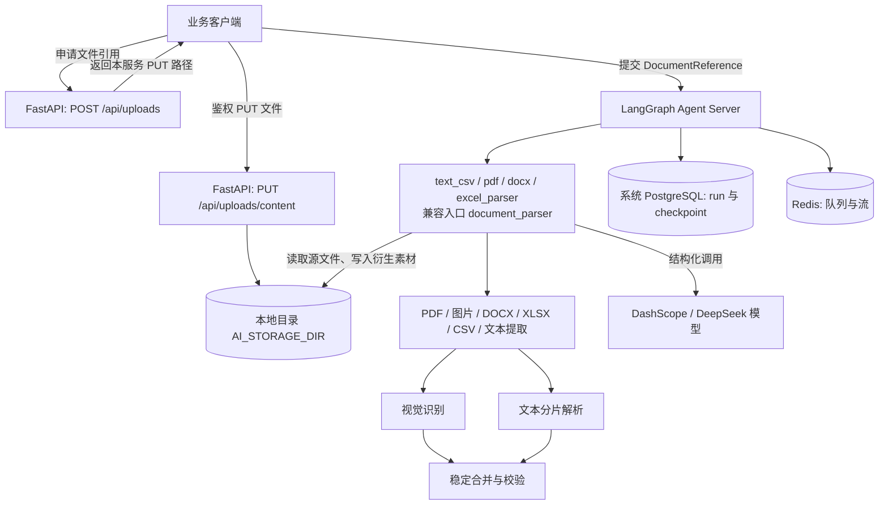

<p align="center">
  
</p>

<h1 align="center">PractiQ AI Server</h1>

<p align="center">把多格式学习资料解析为结构化题目与素材。</p>

PractiQ AI Server 是一个基于 LangGraph 的文档理解服务。它读取文本、PDF、图片、Word、Excel 和 CSV，提取题目、题组、选项、原文答案与视觉元素，并返回可校验的结构化结果。

## 使用流程

```text
申请文件引用 → 经鉴权接口上传至本地目录 → 按格式选择 Graph → 获取结构化结果
```

仓库注册四个格式专用 Graph，以及一个兼容入口：

| Graph ID | `document.sourceType` |
| --- | --- |
| `text_csv_parser` | `text`、`csv` |
| `pdf_parser` | `pdf` |
| `docx_parser` | `docx` |
| `excel_parser` | `xlsx`（不支持旧版 `.xls`） |
| `document_parser` | 原有全部格式，包括 `image`；兼容已有调用 |

各入口共用提取、视觉处理、分片与合并逻辑。专用入口在读取本地文件 前校验格式，
不匹配时抛出 `DOCUMENT_SOURCE_TYPE_MISMATCH`；从 checkpoint 恢复到读取节点时也会校验。
这些 Graph 仍共享当前部署的 worker 与并发设置，不提供独立资源隔离。

## 系统架构



## 核心边界

- 原生 API 源文件经服务令牌鉴权的 PUT 接口写入本地目录；产品兼容入口将内联文件写入相同命名空间。解析前均校验大小和 SHA-256。
- DOCX 仅通过确定性类型路由调用内部字节工具；正文由 `python-docx` 提取，复杂部件按需由 `docx2python` 补充。
- PDF 页图和文档内嵌图片可并行识别；单个视觉或文本分片失败会保留明细并返回 `PARTIAL`。
- Graph State 只保存对象引用和结构化结果，不保存文件 Base64。
- 模型输出经过 Pydantic 校验；失败调用受统一重试与并发上限约束。
- `product/` 保留产品后端调用的答案生成与学习报告接口；题库 CRUD、导入队列、持久化和重试由 `backend/` 中的 Python FastAPI 产品后端管理。单用户版不再计费。

## 快速开始

本地使用 Miniconda 的 `langgragh` 环境（Python 3.14）；以下命令均先激活该环境。
直接使用该环境中的命令，不运行会创建项目 `.venv` 的 `uv run` / `uv sync`。CI 仍使用 `uv.lock`。

```bash
cd server  # from the PractiQ repository root
test -f .env || cp .env.example .env
source /home/sheny/miniconda3/etc/profile.d/conda.sh
conda activate langgragh
uv pip install --python "$CONDA_PREFIX/bin/python" -e ".[dev]"
langgraph dev --no-browser --port 8090
# Or from repository root: make server-dev (also loads root .env.local)
```

请求需携带 `Authorization: Bearer $AI_SERVICE_TOKEN`。文件先通过 `POST /api/uploads` 获取本服务的相对 PUT 路径（`upload.url`），使用相同服务令牌和返回的 Content-Type 上传原始二进制，再把返回的 `DocumentReference` 交给对应 Graph。原生 Graph 不接受内联文本、URL、Base64 或服务端本地路径。产品 `/api/v1/ai/parse-document` 兼容入口仍接受原来的内联 DTO，由 `product/document_parser.py` 转为本地文件引用，运行同一个 Graph。

例如，上传 PDF 后，向 `POST /threads/{thread_id}/runs` 提交以下请求；
`input.document` 使用上传接口实际返回的引用（下面的占位值需替换）：

```json
{
  "assistant_id": "pdf_parser",
  "input": {
    "document": {
      "sourceType": "pdf",
      "objectKey": "practiq-agent/sources/<sha256>/source.pdf",
      "sha256": "<sha256>",
      "mediaType": "application/pdf",
      "sizeBytes": 12345,
      "fileName": "quiz.pdf"
    }
  }
}
```

Run 创建响应仍返回运行信息；完成后的 Graph 输出仍为
`{ "status": "SUCCEEDED", "result": { ... }, "processing": { ... }, "usage": [ ... ] }`，
也可能返回 `PARTIAL` 或运行失败。已有评测和压测脚本继续使用兼容入口。

## 可复现证据

版本化报告记录本地真实服务结果，不代表生产 SLO。评测集现有 19 份公开合成文档（含 2 个预期拒绝案例）、35 道题；使用规则评分、人工金标和不回退门禁。数据集、指标、基线比较与坏例修复流程见 [`docs/evaluation.md`](docs/evaluation.md)。

2026-09-05 的首次 v2 实跑为 **FAILED**：15 个 `SUCCEEDED`、1 个 `PARTIAL`、3 个 `ERROR`（其中 2 个符合预期拒绝）。严格题干匹配 Precision 为 72.73%、Recall 为 68.57%，原文答案准确率为 37.14%。这不是有效基线；题型前缀和 LaTeX 等价形式引起的差异需与真实字段错误分开复核。见 [评测报告](reports/evaluations/b66d5814-eea3-439b-9117-e2243a8bcc9c/report.md) 和 [逐题原始结果](reports/evaluations/b66d5814-eea3-439b-9117-e2243a8bcc9c/report.json)。

下面保留 2026-09-04 的历史失败证据，不能作为当前 v2 评测的有效基线：

| 检查 | 历史结果 | 原始报告 |
| --- | --- | --- |
| 12 份公开合成文档、24 道题 | **FAILED**；保留真实失败明细 | [`reports/evaluation.json`](reports/evaluation.json) |
| `langgraph dev`、20 任务 / 5 客户端并发冒烟门 | **FAILED**；未继续执行 100 / 25 基线 | [`reports/load-test.local.json`](reports/load-test.local.json) |

运行真实文档理解评测：

```bash
python scripts/evaluate.py --validate-only
python -m dotenv -f .env run -- python scripts/evaluate.py --repetitions 3
```

每次生成独立的 JSON/Markdown 报告并显示路径。通过的三次重复报告可显式作为 `--baseline`；
`--compare 基线报告 候选报告` 可在无凭证、无外部调用的环境中比较已有报告。
PR 的自动化检查只验证评测器与工程行为；模型效果由真实实跑报告证明。

本地容量门禁需先启动 `langgraph dev`，冒烟通过后再运行最终基线：

```bash
python -m dotenv -f .env run -- python scripts/load_test.py \
  --base-url http://127.0.0.1:8090 \
  --text '1. What is 2 + 2? A. 3 B. 4 Answer: B' \
  --total 20 --submit-concurrency 5 \
  --output reports/load-test.local.json

python -m dotenv -f .env run -- python scripts/load_test.py \
  --base-url http://127.0.0.1:8090 \
  --text '1. What is 2 + 2? A. 3 B. 4 Answer: B' \
  --total 100 --submit-concurrency 25 \
  --output reports/load-test.local.json
```

评测覆盖公开合成小样本、单次运行配置的模型和本地文件存储，直接调用本地 Graph；压测调用本地 `langgraph dev`。`confidence` 未校准。

## 开发与质量检查

```bash
python -m ruff check src tests product_tests scripts
python -m pyright
python -m coverage run -m pytest
python -m coverage report
langgraph validate
uv build
```

部署、监控、备份、压测和回滚说明见 [`docs/operations.md`](docs/operations.md)。

## Monorepo integration

See [migration/Java contract](docs/migration.md) for the preserved API, answer-key mapping, partial results, image access and billing behavior. This directory is self-contained: package, tests, fixtures, evals, historical reports, assets, scripts, graph configuration and lockfile all live here. Source repository deletion does not change imports or commands. Run `make test-server` at the repository root, or `python -m pytest` here in Conda.

`POST /api/artifacts/read` accepts an `ArtifactReference` and returns checksum-verified bytes under service-token authentication. Keep this private. Java task results also retain bounded `imageBase64` previews and original `imageRef`; no client needs a service token to read its authorized task result. For local development, use the host Miniconda `langgragh` environment and `make server-dev`; root Compose contains only PostgreSQL and Redis, with no AI profile. This mode does not provide production PostgreSQL-backed task/checkpoint recovery. The root `Dockerfile.server` remains a standalone production reference; see `docs/operations.md` for its separate licensing and persistence requirements.

## 本地文件存储

`AI_STORAGE_DIR` 默认 `.local/ai`，相对路径始终以仓库根目录解析，也支持绝对路径。
源文件存于 `practiq-agent/sources/`，派生文本与图片存于 `practiq-agent/artifacts/`；引用继续使用相对 `objectKey`，不会返回服务器绝对路径。
上传地址不是预签名 URL，不含凭证、无需 `expiresAt`；PUT 必须携带服务令牌。浏览器仍只访问产品后端，不能获得此令牌。
产品媒体目录 `MEDIA_DIR`（默认 `.local/media`）与 AI 存储分开。两处目录都需要持久保存并随数据库备份；容器部署请把 `AI_STORAGE_DIR` 设置为持久挂载的绝对路径。
不再需要 OSS SDK、bucket、endpoint 或访问密钥；旧云端对象未被读取、迁移或删除。已有 checkpoint 如引用云端文件，需要将对应对象保留原 `objectKey` 复制到此目录后才能恢复。
