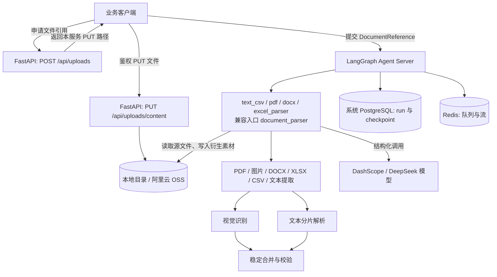

<p align="center">
  
</p>

<h1 align="center">PractiQ AI Server</h1>

<p align="center">把多格式学习资料解析为结构化题目与素材。</p>

PractiQ AI Server 是一个基于 LangGraph 的文档理解服务。它读取文本、PDF、图片、Word、Excel 和 CSV，提取题目、题组、选项、原文答案与视觉元素，并返回可校验的结构化结果。

## 使用流程

```text
申请文件引用 → 经鉴权接口上传至配置的存储 → 按格式选择 Graph → 获取结构化结果
```

仓库注册四个格式专用 Graph，以及一个兼容入口：

| Graph ID | `document.sourceType` |
| --- | --- |
| `text_csv_parser` | `text`、`csv` |
| `pdf_parser` | `pdf` |
| `docx_parser` | `docx` |
| `excel_parser` | `xlsx`（不支持旧版 `.xls`） |
| `document_parser` | 原有全部格式，包括 `image`；兼容已有调用 |

各入口共用提取、视觉处理、分片与合并逻辑。专用入口在读取本地文件 前校验格式，
不匹配时抛出 `DOCUMENT_SOURCE_TYPE_MISMATCH`；从 checkpoint 恢复到读取节点时也会校验。
这些 Graph 仍共享当前部署的 worker 与并发设置，不提供独立资源隔离。

## 系统架构



## 核心边界

- 原生 API 源文件经服务令牌鉴权的 PUT 接口写入选定存储。解析前均校验大小和 SHA-256。
- DOCX 通过内部字节工具校验文件，以 LibreOffice 转临时 PDF，再逐页渲染；同时直接提取内嵌原图。
- PDF（含文字版）与 DOCX 的全部页面均以约 200 DPI 转图，必须配置视觉模型。页面图像直接输出结构化题目、分组和图形，不生成 OCR 文本、不再交给文本模型提题。每页携带相邻页作为上下文，只输出起始于本页的题目；超出窗口的续文保留缺失字段，不猜测。失败页单独补跑并重新合并，成功页不重算。页内配图由模型提供边界框，Pillow 执行裁剪。DOCX 原图与页内裁剪图分别以描述前缀 `[embedded original]`、`[page crop]` 标注来源，不推测对应关系或自动绑定题目。页图和内嵌图片可并行识别；单个视觉或文本分片失败会保留明细并返回 `PARTIAL`。
- Graph State 只保存对象引用和结构化结果，不保存文件 Base64。
- 模型输出经过 Pydantic 校验；失败调用受统一重试与并发上限约束。

## 快速开始

本地使用已有 Python 3.14+ 环境；以下命令中的 Python 与工具应来自同一环境。
直接使用该环境中的命令，不运行会创建项目 `.venv` 的 `uv run` / `uv sync`。CI 仍使用 `uv.lock`。

```bash
cd server  # from the PractiQ repository root
test -f .env || cp .env.example .env
uv pip install --python "$(command -v python)" -e ".[dev]"
langgraph dev --no-browser --host 127.0.0.1 --port 8090
# Or from repository root: make server-dev (loads server/.env)
```

请求需携带 `Authorization: Bearer $AI_SERVICE_TOKEN`。文件先通过 `POST /api/uploads` 获取本服务的相对 PUT 路径（`upload.url`），使用相同服务令牌和返回的 Content-Type 上传原始二进制，再把返回的 `DocumentReference` 交给对应 Graph。原生 Graph 不接受内联文本、URL、Base64 或服务端本地路径。原产品 `/api/v1/ai/*` 接口已移除。

例如，上传 PDF 后，向 `POST /threads/{thread_id}/runs` 提交以下请求；
`input.document` 使用上传接口实际返回的引用（下面的占位值需替换）：

```json
{
  "assistant_id": "pdf_parser",
  "input": {
    "document": {
      "sourceType": "pdf",
      "objectKey": "practiq-agent/sources/<sha256>/source.pdf",
      "sha256": "<sha256>",
      "mediaType": "application/pdf",
      "sizeBytes": 12345,
      "fileName": "quiz.pdf"
    }
  }
}
```

Run 创建响应仍返回运行信息；完成后的 Graph 输出仍为
`{ "status": "SUCCEEDED", "result": { ... }, "processing": { ... }, "usage": [ ... ] }`，
也可能返回 `PARTIAL` 或运行失败。已有评测和压测脚本继续使用兼容入口。

## 可复现证据

版本化报告记录本地真实服务结果，不代表生产 SLO。评测集现有 19 份公开合成文档（含 2 个预期拒绝案例）、35 道题；使用规则评分、人工金标和不回退门禁。数据集、指标、基线比较与坏例修复流程见 [`docs/evaluation.md`](docs/evaluation.md)。

2026-09-05 的首次 v2 实跑为 **FAILED**：15 个 `SUCCEEDED`、1 个 `PARTIAL`、3 个 `ERROR`（其中 2 个符合预期拒绝）。严格题干匹配 Precision 为 72.73%、Recall 为 68.57%，原文答案准确率为 37.14%。这不是有效基线；题型前缀和 LaTeX 等价形式引起的差异需与真实字段错误分开复核。见 [评测报告](reports/evaluations/b66d5814-eea3-439b-9117-e2243a8bcc9c/report.md) 和 [逐题原始结果](reports/evaluations/b66d5814-eea3-439b-9117-e2243a8bcc9c/report.json)。

下面保留 2026-09-04 的历史失败证据，不能作为当前 v2 评测的有效基线：

| 检查 | 历史结果 | 原始报告 |
| --- | --- | --- |
| 12 份公开合成文档、24 道题 | **FAILED**；保留真实失败明细 | [`reports/evaluation.json`](reports/evaluation.json) |
| `langgraph dev`、20 任务 / 5 客户端并发冒烟门 | **FAILED**；未继续执行 100 / 25 基线 | [`reports/load-test.local.json`](reports/load-test.local.json) |

运行真实文档理解评测：

```bash
python scripts/evaluate.py --validate-only
python -m dotenv -f .env run -- python scripts/evaluate.py --repetitions 3
```

每次生成独立的 JSON/Markdown 报告并显示路径。通过的三次重复报告可显式作为 `--baseline`；
`--compare 基线报告 候选报告` 可在无凭证、无外部调用的环境中比较已有报告。
PR 的自动化检查只验证评测器与工程行为；模型效果由真实实跑报告证明。

本地容量门禁需先启动 `langgraph dev`，冒烟通过后再运行最终基线：

```bash
python -m dotenv -f .env run -- python scripts/load_test.py \
  --base-url http://127.0.0.1:8090 \
  --text '1. What is 2 + 2? A. 3 B. 4 Answer: B' \
  --total 20 --submit-concurrency 5 \
  --output reports/load-test.local.json

python -m dotenv -f .env run -- python scripts/load_test.py \
  --base-url http://127.0.0.1:8090 \
  --text '1. What is 2 + 2? A. 3 B. 4 Answer: B' \
  --total 100 --submit-concurrency 25 \
  --output reports/load-test.local.json
```

评测覆盖公开合成小样本、单次运行配置的模型和配置的文件存储，直接调用本地 Graph；压测调用本地 `langgraph dev`。`confidence` 未校准。

## 开发与质量检查

```bash
python -m ruff check src tests scripts
python -m pyright
python -m coverage run -m pytest
python -m coverage report
langgraph validate
uv build
```

部署、监控、备份、压测和回滚说明见 [`docs/operations.md`](docs/operations.md)。

## 素材读取

`POST /api/artifacts/read` 接收 `ArtifactReference`，校验文件大小和 SHA-256 后返回原始字节，需携带服务令牌。Graph 输出保留文件引用，不返回 Base64 文件内容。

## 文件存储：本地与阿里云 OSS

通过 `AI_STORAGE_BACKEND=local|oss` 选择模式，默认 `local`。两种模式使用同一套原生上传、解析和素材读取接口，均校验命名空间、大小和 SHA-256；Graph State 只保存对象引用。上传地址始终是本服务的相对 PUT 路径，不返回 OSS 凭证或签名 URL。

- **本地**：`AI_STORAGE_DIR` 默认 `.local/ai`，相对路径以 `server/` 为基准；生产使用持久挂载的绝对路径并备份。
- **OSS**：配置 `AI_OSS_REGION`、`AI_OSS_BUCKET`、`AI_OSS_ACCESS_KEY_ID`、`AI_OSS_ACCESS_KEY_SECRET`。支持可选 `AI_OSS_SECURITY_TOKEN`；临时凭证需在过期前更新并重启服务。Bucket 需预先创建并保持私有。
- 可选 `AI_OSS_ENDPOINT` 指定 HTTPS 端点，留空由地域生成；使用已绑定的自定义域名时设置 `AI_OSS_USE_CNAME=true`。

源文件使用 `practiq-agent/sources/`，衍生文本与图片使用 `practiq-agent/artifacts/`；OSS 对象键与本地相对路径一致。仅授予这些前缀所需的 GetObject（含 HEAD）与 PutObject 权限，不需要创建 Bucket、列举或删除权限。OSS 使用[官方 Python SDK V2](https://www.alibabacloud.com/help/en/oss/developer-reference/2-0-manual-preview-version/)；连接和读写超时沿用 `AI_STORAGE_TIMEOUT_SECONDS`，异常返回统一存储错误。

切换模式不自动迁移、清理或回退。迁移时需按原 objectKey 复制并验证全部引用对象；新版执行快照拒绝存储位置变化，原任务须在原部署完成或迁移后新建任务。备份时与生产任务数据库保持一致。离线测试覆盖双模式契约，但不替代真实 OSS 网络、RAM 权限与 Bucket 配置验收。

## Word / PDF 全页视觉解析运行要求

所有格式共用必填的 `LLM_VISION_MODEL`；移除 `LLM_TEXT_MODEL`，缺失视觉模型配置时启动失败。文本、CSV、Excel 仍按原始文本分片，但直接交给同一视觉模型；图片、PDF、DOCX 页面不进入文本分片流程。DOCX 另需 LibreOffice Writer 与中文字体（Linux 推荐 `fonts-noto-cjk`）；部署镜像已包含这两项。可通过 `AI_SOFFICE_PATH` 指定可执行文件，默认从 PATH 查找 `soffice`。转换缺失、失败、超时分别返回 `DOCX_CONVERTER_MISSING`、`DOCX_CONVERSION_FAILED`、`DOCX_CONVERSION_TIMEOUT`。

每次转换使用独立临时目录和 LibreOffice 用户配置，60 秒超时后终止进程组并清理；临时 PDF 不持久保存，页图和配图进入现有素材存储。分页以服务器字体与 LibreOffice 渲染为准，可能与 Microsoft Word 不同。既有页数、像素、视觉总字节和裁剪上限仍适用；全页识别会增加模型调用成本与耗时。

返回的 `page` 为零起始页索引。DOCX 原图无可靠位置时不填页码或坐标。自动化测试不调用真实模型；真实识别质量需另行验收。

## 长任务控制

五个 Graph 共用 [任务 API 与恢复规则](docs/document-tasks.md)。默认仍返回 `PARTIAL`；`failurePolicy="review"` 在处理失败时等待补跑或接受部分结果。原生 `{document: ...}` 输入与最终结果结构保留。所有变更请求使用 UUID `requestId`；恢复使用最新 `checkpointId`，暂停/中断使用目标 `runId`。请求受理与实际停止分开查询。
