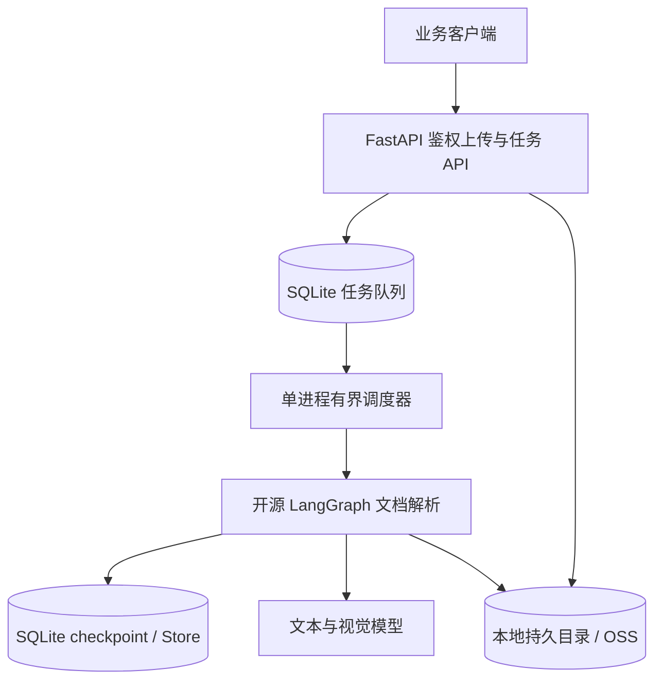

# 服务接入与开发指南

[返回产品介绍](../../README.zh-CN.md) · [English overview](../../README.md)

本文说明环境配置、接口接入、解析边界与工程验证。命令默认从仓库根目录执行；历史报告仅代表对应版本的结果。

## 本地运行

使用已有 Python 3.14+ 解释器，不创建项目 `.venv`。`AI_PYTHON` 可指定解释器路径。

```bash
# 仅首次复制；已有模型配置不要覆盖
cp -n .env.example .env
# 配置服务令牌、模型、专用 SQLite 数据目录及独立文件存储
make install AI_PYTHON=/path/to/python3.14
make init-db AI_PYTHON=/path/to/python3.14
make server-dev AI_PYTHON=/path/to/python3.14
```

默认监听 `127.0.0.1:8090`，活性检查为 `GET /ok`，就绪检查为 `GET /ready`。本地和生产均需要 SQLite；初始化仅接受空数据库，不读取或迁移旧 Agent Server 数据。单服务进程持有独占锁，重启自动恢复未完成任务，人工暂停和审核保持等待。

`LLM_TEXT_MODEL` 与 `LLM_VISION_MODEL` 均必填，共用 provider 和 API key。TXT/CSV 使用文本模型；PDF/图片直接视觉提题。PDF 由 PDFium 渲染；部署镜像包含中文字体，不依赖办公软件。Word（.doc/.docx）请先在 Word 或 WPS 中导出为 PDF。

源图片仅支持 PNG/JPEG（`image/png`、`image/jpeg`）。WebP/GIF 的上传声明返回 422；即使伪装为 PNG/JPEG，解析时也按实际格式拒绝。历史题库图片与备份不删除。

## 导入流程

1. 携带 `Authorization: Bearer <AI_SERVICE_TOKEN>`，调用 `POST /api/uploads` 申请文件引用。
2. 使用返回的地址和 Content-Type 鉴权 PUT 原始文件；已有文件可能直接返回引用。
3. 将 `document` 与 UUID `requestId` 交给 `POST /api/document-tasks`，通过 `GET /api/document-tasks/{threadId}` 查询；不再暴露官方原生 Graph/SDK API。
4. 使用 `POST /api/artifacts/read` 提交 `ArtifactReference`，鉴权并校验大小与 SHA-256 后读取原始素材字节。

支持 `text_csv_parser`、`pdf_parser`，以及覆盖全部格式的 `document_parser`。任务入口不接受 URL、Base64 或服务器路径；原产品 `/api/v1/ai/*` 接口已移除。

暂停、中断、恢复、补跑、接受部分结果统一调用 `POST /api/document-tasks/{threadId}/control`。请求示例、幂等规则、180 天期限见 [任务控制说明](document-tasks.md)。

## 验证与数据

```bash
make test AI_PYTHON=/path/to/python3.14
make verify AI_PYTHON=/path/to/python3.14
make audit AI_PYTHON=/path/to/python3.14
make image-check
```

数据库测试显式使用 `disposable_databases` fixture，使用临时 SQLite 文件目录，无需 Docker 数据库。纯单元测试（如 `cd server && python -m pytest tests/test_schemas.py tests/test_auth.py`）不需要数据库或 Docker。共享替身与数据构造位于 `tests/support.py`，数据库辅助函数位于 `tests/db_support.py`。CI 安装 PDF 回退字体，并使用真实 PDFium 验证文字版、扫描版和混合 PDF 的逐页渲染；不需要外部转换器。

`make verify` 检查锁文件一致性、Ruff lint、Pyright 类型、评估数据、单次测试与至少 90% 覆盖率、恢复探针和包构建。`make audit` 仅审计锁定的运行及开发依赖，需要联网，发现漏洞或审计错误时失败；`make image-check` 需要 Docker，仅构建服务镜像，不发布。

CI 对所有 PR、`main` 推送及手动触发执行相同 Make 目标，使用 Ubuntu 24.04、Python 3.14 和 uv 0.12.13。`make install-locked AI_PYTHON=/path/to/python3.14` 将锁定依赖和可编辑项目安装到指定解释器，不创建项目 `.venv`；CI 使用专用解释器。原有 `make install` 保留为本地开发便捷入口。作业超时为 20 分钟，同一工作流/ref 的新运行取消旧运行。JUnit、覆盖率 XML、探针 JSON/Markdown 输出到 `server/reports/checks/`，每轮验证仅替换这四份生成报告；CI 保留已有报告 14 天，测试失败时也上传。恢复探针仅提供回归证据，不代表完整生产崩溃恢复验收。

自动化测试不调用真实模型；[评测说明](evaluation.md) 和历史报告保留，历史失败结果不代表当前质量基线。

支持 `AI_STORAGE_BACKEND=local`（默认）和 `oss` 两种模式，共用鉴权上传和素材读取接口，保留大小与 SHA-256 校验。

本地模式下，AI 文件默认存放于 `server/.local/ai-oss`，相对 `AI_STORAGE_DIR` 以 `server/` 为基准解析；生产使用持久挂载的绝对路径并备份。精简项目不会迁移或删除已有数据库、卷、文件和本地配置。生产部署参考 [运维说明](operations.md) 与 `Dockerfile.server`。

OSS 模式需在 `.env` 配置 `AI_OSS_REGION`、`AI_OSS_BUCKET`、`AI_OSS_ACCESS_KEY_ID` 和 `AI_OSS_ACCESS_KEY_SECRET`；临时 STS 凭证可加 `AI_OSS_SECURITY_TOKEN`。可通过 `AI_OSS_ENDPOINT` 指定 HTTPS 端点；使用已绑定到 Bucket 的自定义域名时，设置 `AI_OSS_USE_CNAME=true`。完整配置见 `.env.example`。

使用已有私有 Bucket，仅授予所需对象的访问权限。凭证保留在服务端，文件仍通过鉴权 API 传输。切换模式不自动迁移数据，也不回退到另一种存储；迁移须按原 objectKey 复制并验证全部对象。新版任务拒绝存储位置变化，须在原部署完成或迁移后新建任务；历史 checkpoint 不升级。临时凭证需在过期前更新并重启服务。

源文件使用 `practiq-agent/sources/`，衍生文本与图片使用 `practiq-agent/artifacts/`；OSS 对象键与本地相对路径一致。仅授予这些前缀所需的 GetObject（含 HEAD）与 PutObject 权限，不需要创建 Bucket、列举或删除权限。OSS 使用[官方 Python SDK V2](https://www.alibabacloud.com/help/en/oss/developer-reference/2-0-manual-preview-version/)；连接和读写超时沿用 `AI_STORAGE_TIMEOUT_SECONDS`，异常返回统一存储错误。

## Graph 与接口示例

仓库注册两个格式专用 Graph，以及一个通用入口：

| Graph ID | `document.sourceType` |
| --- | --- |
| `text_csv_parser` | `text`、`csv` |
| `pdf_parser` | `pdf` |
| `document_parser` | `text`、`csv`、`pdf`、`image` |

各入口共用提取、视觉处理、分片与合并逻辑。专用入口在读取本地文件前校验格式，
不匹配时抛出 `DOCUMENT_SOURCE_TYPE_MISMATCH`；从 checkpoint 恢复到读取节点时也会校验。
这些 Graph 仍共享当前部署的 worker 与并发设置，不提供独立资源隔离。

例如上传 PDF 后，向 `POST /api/document-tasks` 提交 `requestId`、`graphId="pdf_parser"` 和上传返回的 `document` 引用。接口返回 202 回执，通过任务 GET 轮询结果和进度；不再提供 `/threads`、`/runs`、`/store` 或原生 SSE 接口。

Graph 结果仍为 `{ "status": "SUCCEEDED", "result": {...}, "processing": {...}, "usage": [...] }`，也可能返回 `PARTIAL` 或执行失败。完整控制示例见 [任务 API](document-tasks.md)。

## 系统架构



## 核心边界

- 源文件经服务令牌鉴权的 PUT 接口写入选定存储。解析前均校验大小和 SHA-256。
- PDF（含文字版）的全部页面均以约 200 DPI 转图，必须配置视觉模型。页面图像直接输出结构化题目、分组和图形，不生成 OCR 文本、不再交给文本模型提题。每页携带相邻页作为上下文，只输出起始于本页的题目；超出窗口的续文保留缺失字段，不猜测。失败页单独补跑并重新合并，成功页不重算。页内配图由模型提供边界框，Pillow 执行裁剪。页内裁剪图以描述前缀 `[page crop]` 标注来源。页图可并行识别；单个视觉或文本分片失败会保留明细并返回 `PARTIAL`。
- Graph State 只保存对象引用和结构化结果，不保存文件 Base64。
- 模型输出经过 Pydantic 校验；失败调用受统一重试与并发上限约束。

## PDF 全页视觉解析运行要求

PDFium 在可终止的隔离进程中渲染页面；页图和裁剪图进入素材存储，临时文件在提取结束后清理。页数、像素、视觉总字节和裁剪上限仍适用；全页识别会增加模型调用成本与耗时。

返回的 `page` 为零起始页索引。自动化测试不调用真实模型；真实识别质量需另行验收。

Word 输入已移除，`AI_SOFFICE_PATH` 不再生效。旧 Word 任务不能继续或重试，请转为 PDF 后新建任务；已导入题库、备份和历史合法 JSON 不受影响。具体错误见 [任务 API](document-tasks.md)。

## 长任务控制

三个 Graph 共用 [任务 API 与恢复规则](document-tasks.md)。默认仍返回 `PARTIAL`；`failurePolicy="review"` 在处理失败时等待补跑或接受部分结果。文档输入与最终结果结构保留。所有变更请求使用 UUID `requestId`；恢复使用最新 `checkpointId`，暂停/中断使用目标 `runId`。请求受理与实际停止分开查询。

## 可复现证据

以下 Agent Server、模型质量与容量报告均为历史证据，不代表迁移后运行时验收。新恢复检查使用独立进程、真实隔离 SQLite 和模型替身。

版本化报告记录本地真实服务结果，不代表生产 SLO。当前评测集有 21 份公开合成文档；以下历史报告对应各自的数据集版本；使用规则评分、人工金标和不回退门禁。数据集、指标、基线比较与坏例修复流程见 [`docs/evaluation.md`](evaluation.md)。

2026-09-05 的首次 v2 实跑为 **FAILED**：15 个 `SUCCEEDED`、1 个 `PARTIAL`、3 个 `ERROR`（其中 2 个符合预期拒绝）。严格题干匹配 Precision 为 72.73%、Recall 为 68.57%，原文答案准确率为 37.14%。这不是有效基线；题型前缀和 LaTeX 等价形式引起的差异需与真实字段错误分开复核。见 [评测报告](../reports/evaluations/b66d5814-eea3-439b-9117-e2243a8bcc9c/report.md) 和 [逐题原始结果](../reports/evaluations/b66d5814-eea3-439b-9117-e2243a8bcc9c/report.json)。

下面保留 2026-09-04 的历史失败证据，不能作为当前 v2 评测的有效基线：

| 检查 | 历史结果 | 原始报告 |
| --- | --- | --- |
| 12 份公开合成文档、24 道题 | **FAILED**；保留真实失败明细 | [`reports/evaluation.json`](../reports/evaluation.json) |
| `langgraph dev`、20 任务 / 5 客户端并发冒烟门 | **FAILED**；未继续执行 100 / 25 基线 | [`reports/load-test.local.json`](../reports/load-test.local.json) |

运行真实文档理解评测：

```bash
cd server  # 从仓库根目录执行
python scripts/evaluate.py --validate-only
python -m dotenv -f ../.env run -- python scripts/evaluate.py --repetitions 3
```

每次生成独立的 JSON/Markdown 报告并显示路径。通过的三次重复报告可显式作为 `--baseline`；
`--compare 基线报告 候选报告` 可在无凭证、无外部调用的环境中比较已有报告。
PR 的自动化检查只验证评测器与工程行为；模型效果由真实实跑报告证明。

本地容量门禁需先启动新 SQLite 运行时，冒烟通过后再运行最终基线：

```bash
cd server  # 从仓库根目录执行
python -m dotenv -f ../.env run -- python scripts/load_test.py \
  --base-url http://127.0.0.1:8090 \
  --text '1. What is 2 + 2? A. 3 B. 4 Answer: B' \
  --total 20 --submit-concurrency 5 \
  --output reports/load-test.local.json

python -m dotenv -f ../.env run -- python scripts/load_test.py \
  --base-url http://127.0.0.1:8090 \
  --text '1. What is 2 + 2? A. 3 B. 4 Answer: B' \
  --total 100 --submit-concurrency 25 \
  --output reports/load-test.local.json
```

评测覆盖公开合成小样本、单次运行配置的模型和配置的文件存储，直接调用本地 Graph；新压测调用本地文档业务 API。`confidence` 未校准。

### 文档边界与纠错补充

图片在送模型与解码裁剪前执行 `AI_MAX_VISION_PAGE_PIXELS` 校验；直接上传多帧图片明确拒绝（`IMAGE_MULTIFRAME_UNSUPPORTED`），请拆成单帧文档。

不完整答案允许缺值，但仍校验容器、元素类型、长度与引用；图片描述和标签在模型纠错边界就执行最终结果约束。默认工具调用协议的纠错历史包含匹配的工具应答，失败调用用量仍保留。文本跨片分组仅在共享已确认的重叠题、标题和材料说明完全一致且匹配唯一时合并；同名不同来源分组保留独立。

存储路径、上传接收期限、进程隔离及升级步骤见 [运维说明](operations.md)。
